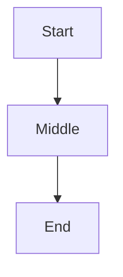
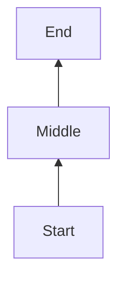
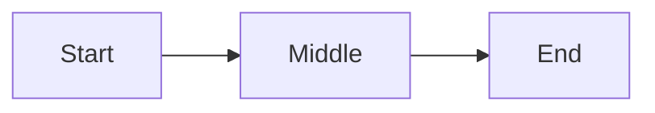
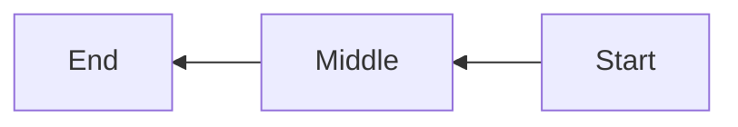

# Orientation

###

<table>
    <tr><td></td><td>Standard</td><td>Reversed</td></tr>
    <tr><td>Vertical</td>
<td>

**TB**: Top to Bottom

</td>
<td>

**BT**: Bottom to Top

</td>
    </tr>
    <tr><td>Horizontal</td>
<td>

**LR**: Left to Right

</td>
<td>

**RL**: Right to Left

</td>
    </tr>
</table>