# Flowcharts

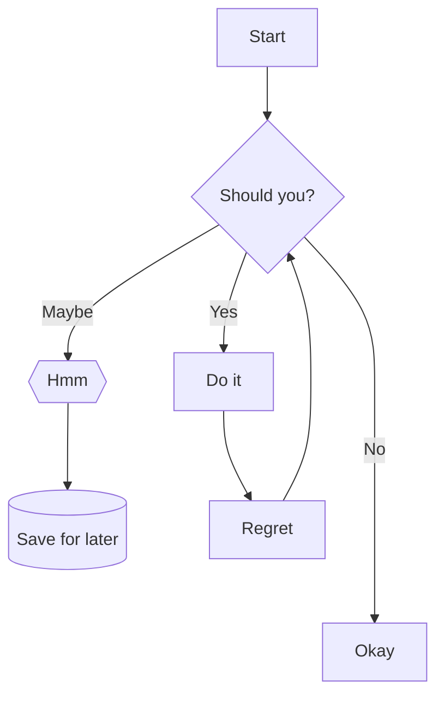

## Nodes

### Node styles

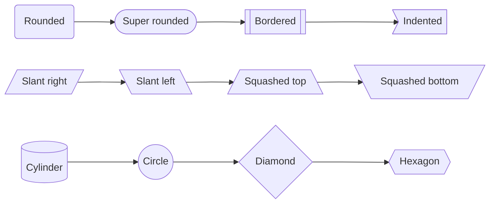

```
flowchart LR; 
    1(Rounded) --> 2([Super rounded]) --> 3[[Bordered]] --> 4>Indented]
    5[/Slant right/] --> 6[\Slant left\] --> 7[/Squashed top\] --> 8[\Squashed bottom/]
    9[(Cylinder)] --> 10((Circle)) --> 11{Diamond} --> 12{{Hexagon}}
```

### Node hyperlinks


```
flowchart LR
    1(Link in same window) --> 2(Link in new window)
    click 1 "https://example.com" _self
    click 2 "https://example.com" _blank
```

*Note: It is possible to [use JavaScript for more advanced actions](https://mermaid-js.github.io/mermaid/#/flowchart?id=interaction) than a simple link.*

## Connections

### Connection styles

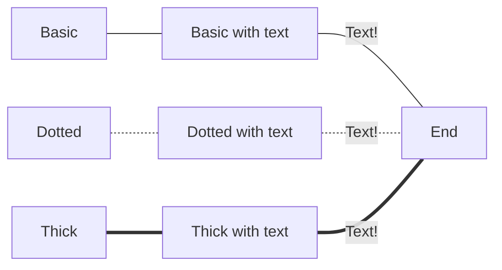

```
flowchart LR
    Basic --- 1[Basic with text] -- Text! --- End
    Dotted -.- 2[Dotted with text] -. Text! .- End
    Thick === 3[Thick with text] == Text! === End
```

### Connection types

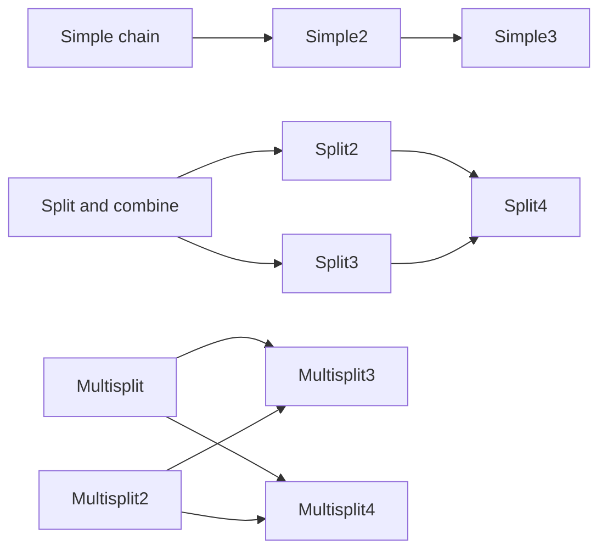

```
flowchart LR
    1[Simple chain] --> Simple2 --> Simple3
    2[Split and combine] --> Split2 & Split3 --> Split4
    3[Multisplit] & Multisplit2 --> Multisplit3 & Multisplit4
```

### Connection lengths

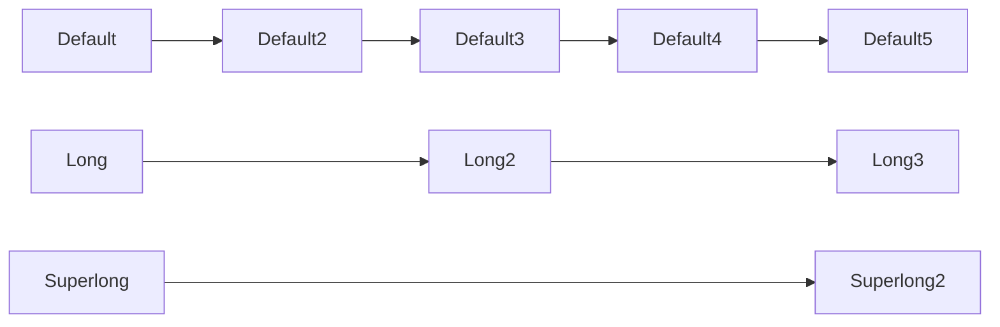

```
flowchart LR
    Default --> Default2 --> Default3 --> Default4 --> Default5
    Long ---> Long2 ---> Long3
    Superlong -----> Superlong2
```
    
### Arrow types

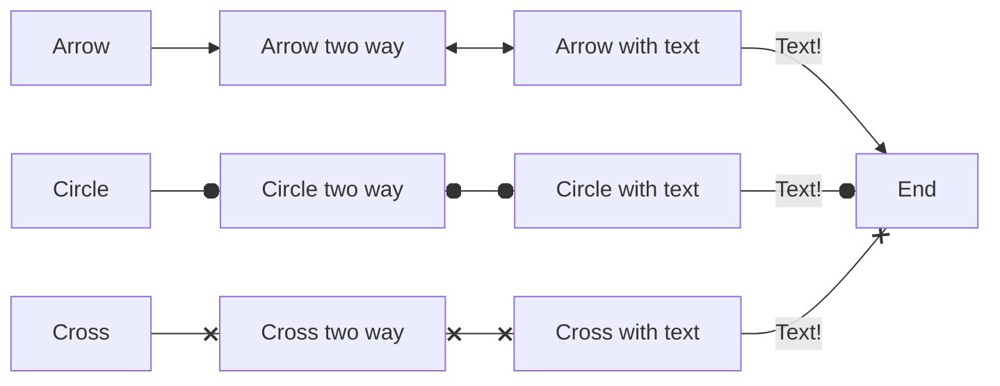

```
flowchart LR
    Arrow --> 1[Arrow two way] <--> 2[Arrow with text] -- Text! --> End
    Circle --o 3[Circle two way] o--o 4[Circle with text] -- Text! --o End
    Cross --x 5[Cross two way] x--x 6[Cross with text] -- Text! --x End
```

## Graphs

### Orientation

<table>
    <tr><td></td><td>Standard</td><td>Reversed</td></tr>
    <tr><td>Vertical</td>
<td>

**TB**: Top to Bottom<br>(also **TD**: Top down)

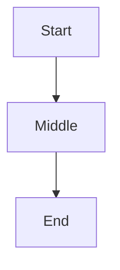

</td><td>

**BT**: Bottom to Top

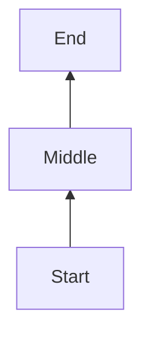

</td>
    </tr>
    <tr><td>Horizontal</td>
<td>

**LR**: Left to Right

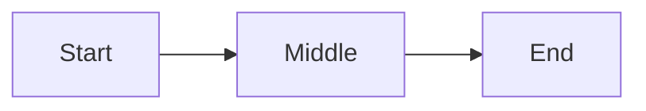

</td><td>

**RL**: Right to Left

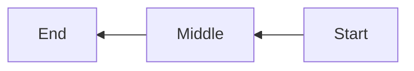
</td>
    </tr>
</table>

## Subgraphs

### Defining
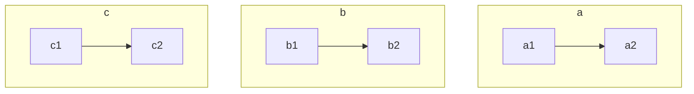

```
flowchart TD
    subgraph a
    a1 --> a2
    end

    subgraph b
    b1 --> b2
    end
    
    subgraph c
    c1 --> c2
    end
```

### Linking
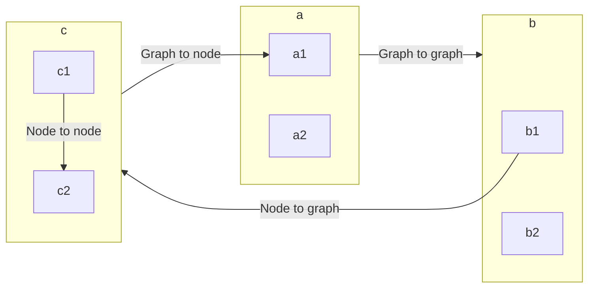

```
flowchart LR
    subgraph a
    a1
    a2 
    end

    subgraph b
    b1
    b2
    end
    
    subgraph c
    c1
    c2
    end

    a -- "Graph to graph" --> b
    c1 -- "Node to node" --> c2
    b1 -- "Node to graph" --> c
    c -- "Graph to node" --> a1
```

### Orientation
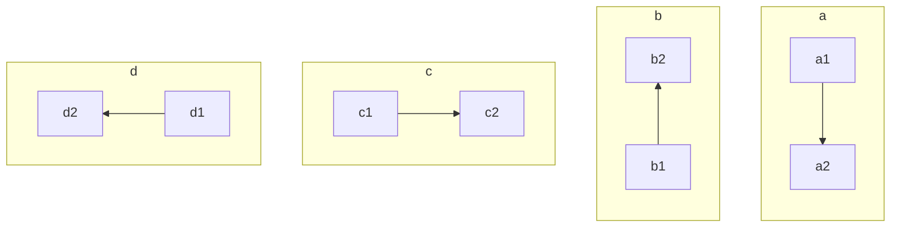

```
flowchart TD
    subgraph a
    direction TB
    a1 --> a2
    end

    subgraph b
    direction BT
    b1 --> b2
    end
    
    subgraph c
    direction LR
    c1 --> c2
    end

    subgraph d
    direction RL
    d1 --> d2
    end

```

## Comments
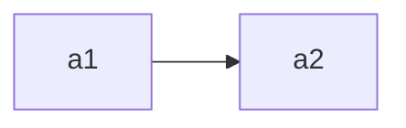

```
flowchart LR
    %% Comment here
    a1 --> a2
    %% Also here
```

## Styling

### Styling individual / groups of nodes

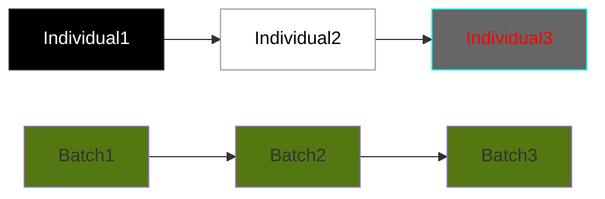

```
flowchart LR
    Individual1 --> Individual2 --> Individual3
    style Individual1 fill:#000, color:#fff, stroke:#333
    style Individual2 fill:#fff, color:#000, stroke:#999
    style Individual3 fill:#666, color:#f00, stroke:#0ff

    Batch1:::myclass --> Batch2:::myclass --> Batch3:::myclass
    classDef myclass fill:#571
```

### Styling all nodes

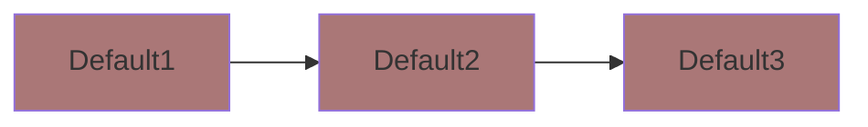

```
flowchart LR
    Default1 --> Default2 --> Default3
    classDef default fill:#A77
```