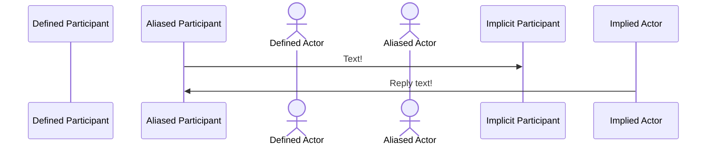
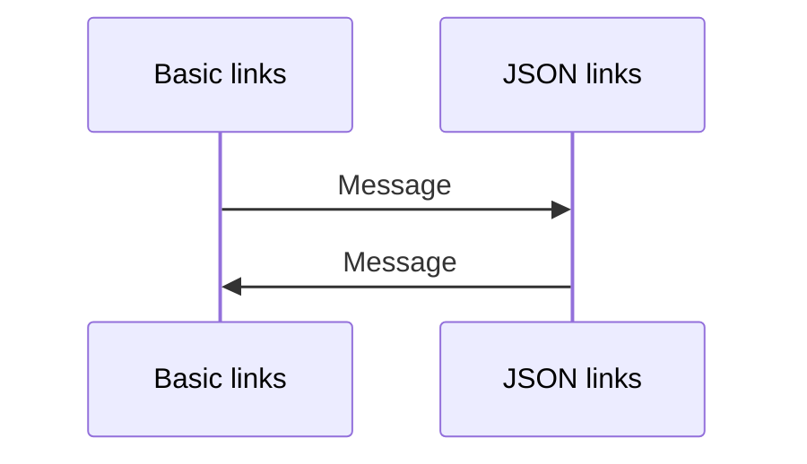
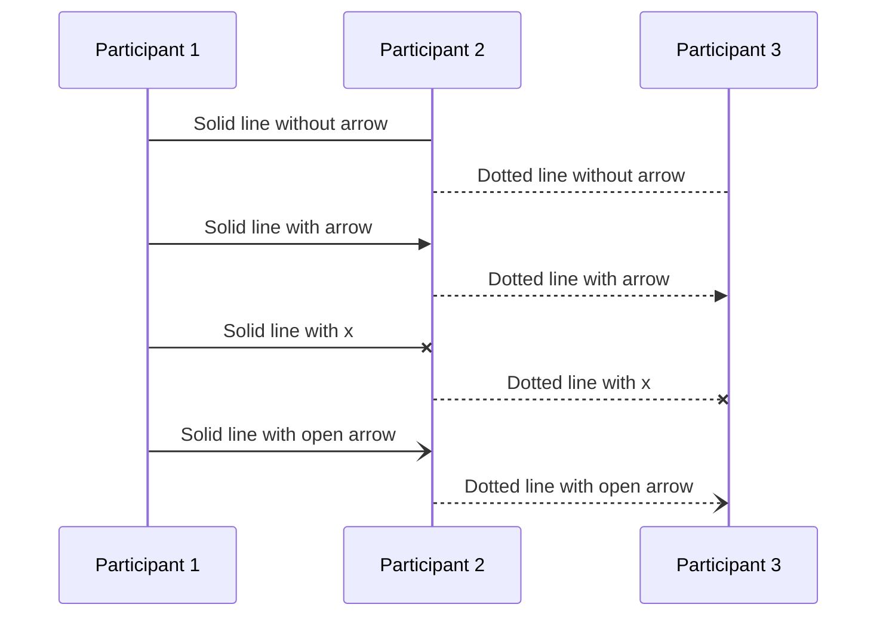
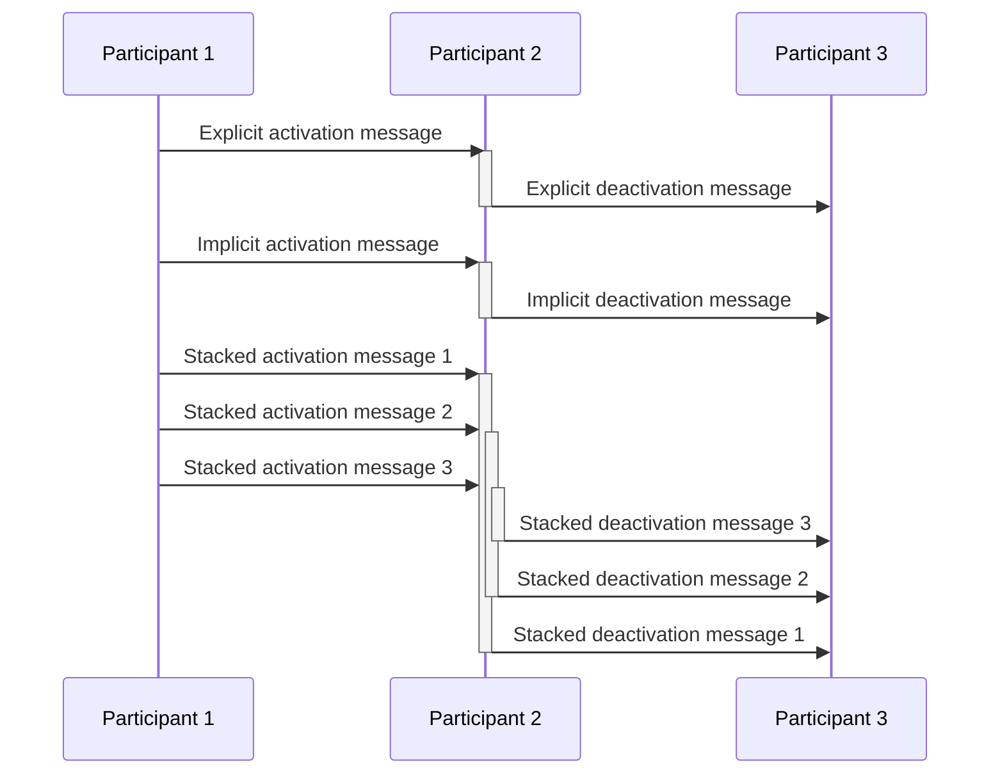
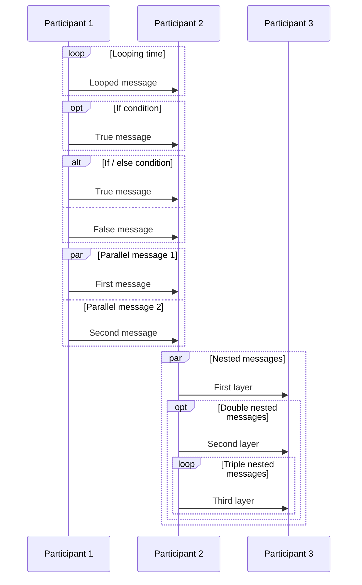
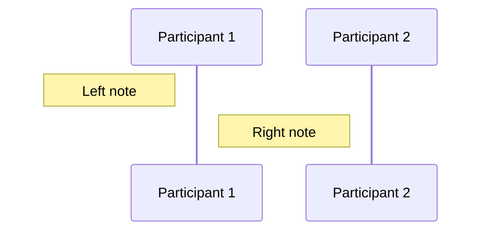
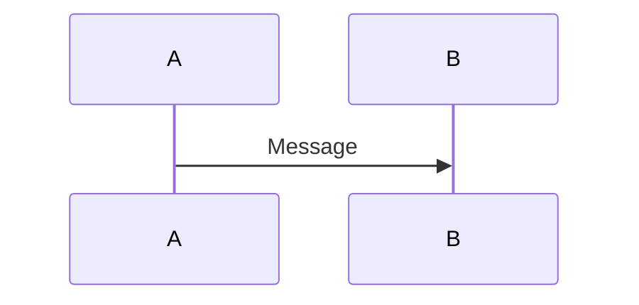

# Sequence diagrams

## Participants

### Types of participant 


```
sequenceDiagram
    participant Defined Participant
    participant p as Aliased Participant
    actor Defined Actor
    actor a as Aliased Actor
    p ->> Implicit Participant: Text!
    Implied Actor ->> p: Reply text!
```

### Participant links


```
sequenceDiagram
    participant p1 as Basic links
    link p1: Link 1 @ https://example.com/1
    link p1: Link 2 @ https://example.com/2

    participant p2 as JSON links
    links p2: {"Link 1": "https://example.com/1", "Link 2": "https://example.com/2"}

    p1->>p2: Message
    p2->>p1: Message
```

## Messages

### Message indicators



```
sequenceDiagram
    participant p1 as Participant 1
    participant p2 as Participant 2
    participant p3 as Participant 3
    p1->p2: Solid line without arrow
    p2-->p3: Dotted line without arrow
    p1->>p2: Solid line with arrow
    p2-->>p3: Dotted line with arrow
    p1-xp2: Solid line with x
    p2--xp3: Dotted line with x
    p1-)p2: Solid line with open arrow
    p2--)p3: Dotted line with open arrow
```

### Messages activations



```
sequenceDiagram
    participant p1 as Participant 1
    participant p2 as Participant 2
    participant p3 as Participant 3
    p1 ->> p2: Explicit activation message
    activate p2
    p2 ->> p3: Explicit deactivation message
    deactivate p2

    p1 ->>+ p2: Implicit activation message
    p2 ->>- p3: Implicit deactivation message

    p1 ->>+ p2: Stacked activation message 1
    p1 ->>+ p2: Stacked activation message 2
    p1 ->>+ p2: Stacked activation message 3
    p2 ->>- p3: Stacked deactivation message 3
    p2 ->>- p3: Stacked deactivation message 2
    p2 ->>- p3: Stacked deactivation message 1
```

### Message attributes



```
sequenceDiagram
    participant p1 as Participant 1
    participant p2 as Participant 2
    participant p3 as Participant 3
    loop Looping time
        p1 ->> p2: Looped message
    end

    opt If condition
        p1 ->> p2: True message
    end

    alt If / else condition
        p1 ->> p2: True message
    else
        p1 ->> p2: False message
    end

    par Parallel message 1
        p1 ->> p2: First message
    and Parallel message 2
        p1 ->> p2: Second message
    end

    par Nested messages
        p2 ->> p3: First layer
        opt Double nested messages
            p2 ->> p3: Second layer
            loop Triple nested messages
                p2 ->> p3: Third layer
            end
        end
    end
```

## Misc

### Notes


```
sequenceDiagram
    participant p1 as Participant 1
    participant p2 as Participant 2
    note left of p1: Left note
    note right of p1: Right note
```

### Comments


```
sequenceDiagram
    %% A comment is hidden in here
    A ->> B: Message
    %% And here
```
