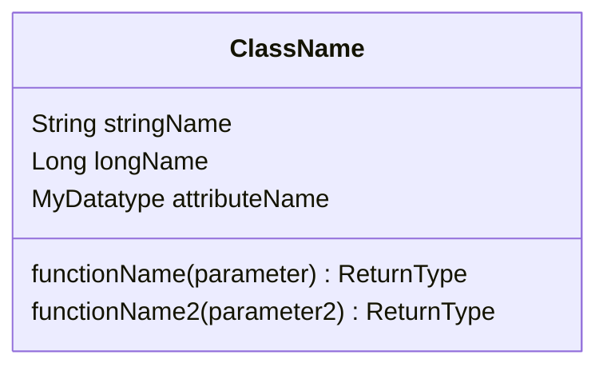
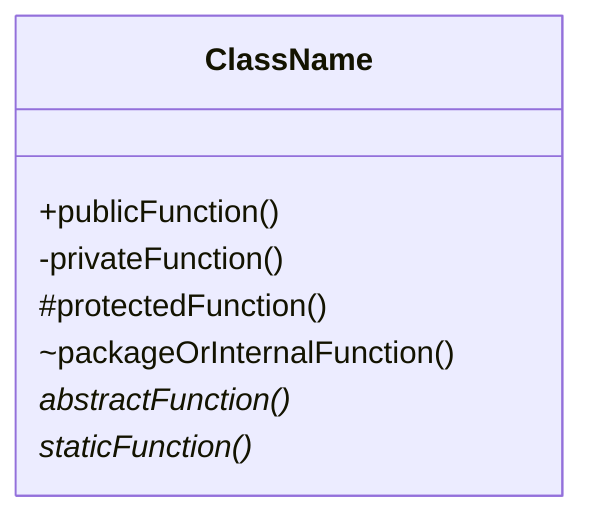
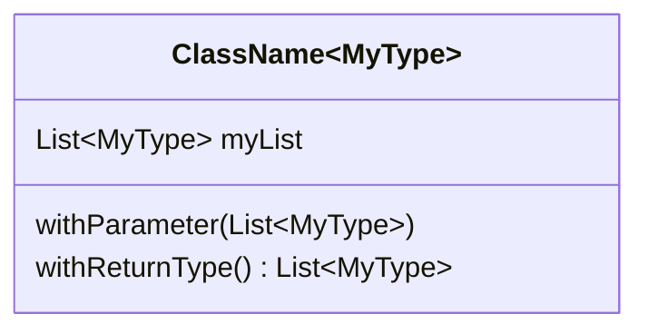
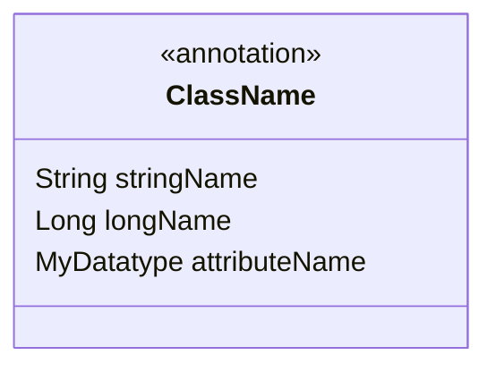
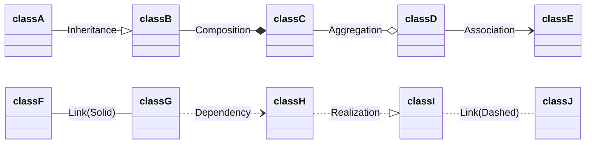
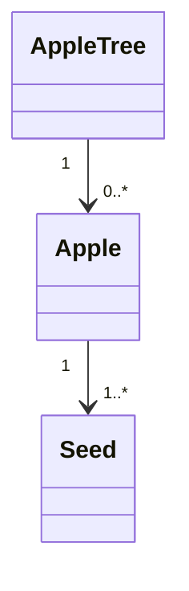
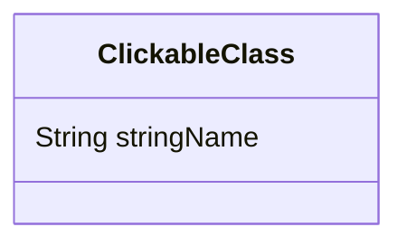
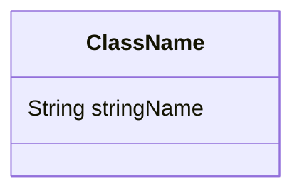

# Class diagrams

## Attribute / function defining

### Basic syntax



```
classDiagram
    class ClassName {
        String stringName
        Long longName
        MyDatatype attributeName

        functionName(parameter) ReturnType
        functionName2(parameter2) ReturnType
    }
```

### Visibility



```
classDiagram
    class ClassName {
        +publicFunction()
        -privateFunction()
        #protectedFunction()
        ~packageOrInternalFunction()
        abstractFunction()*
        staticFunction()*
    }
```

### Generics



```
classDiagram
    class ClassName~MyType~ {
        List~MyType~ myList
        withParameter(List~MyType~)
        withReturnType() List~MyType~
    }
```

### Annotations



```
classDiagram
    class ClassName {
        <<annotation>>
        String stringName
        Long longName
        MyDatatype attributeName
    }
```

## Relationship defining

### Relationship



```
classDiagram
    direction LR
    classA --|> classB : Inheritance
    classB --* classC : Composition
    classC --o classD : Aggregation
    classD --> classE : Association
    classF -- classG : Link(Solid)
    classG ..> classH : Dependency
    classH ..|> classI : Realization
    classI .. classJ : Link(Dashed)
```

### Cardinality / multiplicity



```
classDiagram
    Apple Tree "1" --> "0..*" Apple
    Apple "1" --> "1..*" Seed
```

## Other functionality

### Links



```
classDiagram
    class ClickableClass {
        String stringName
    } 
    click ClickableClass href "https://example.com"
```

*Note: It is possible to [use JavaScript for more advanced actions](https://mermaid-js.github.io/mermaid/#/classDiagram?id=interaction) than a simple link.*

### Comments



```
classDiagram
%% A comment is here
    class ClassName {
        String stringName
    } 
%% And here
```

### Styling

*Styling requires CSS, and is defined [on the official documentation](https://mermaid-js.github.io/mermaid/#/classDiagram?id=styling).*
