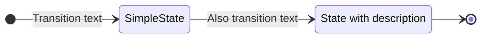
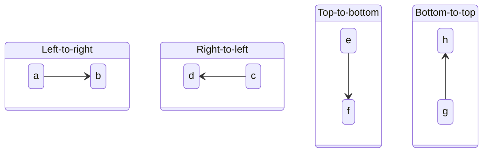
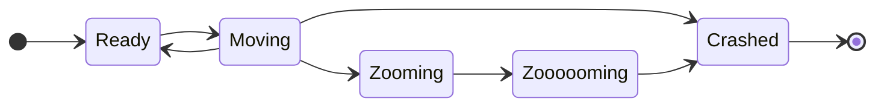
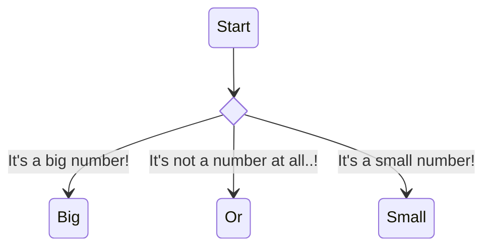
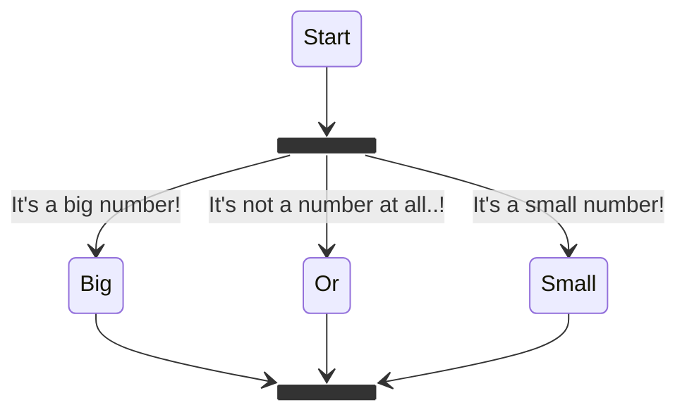
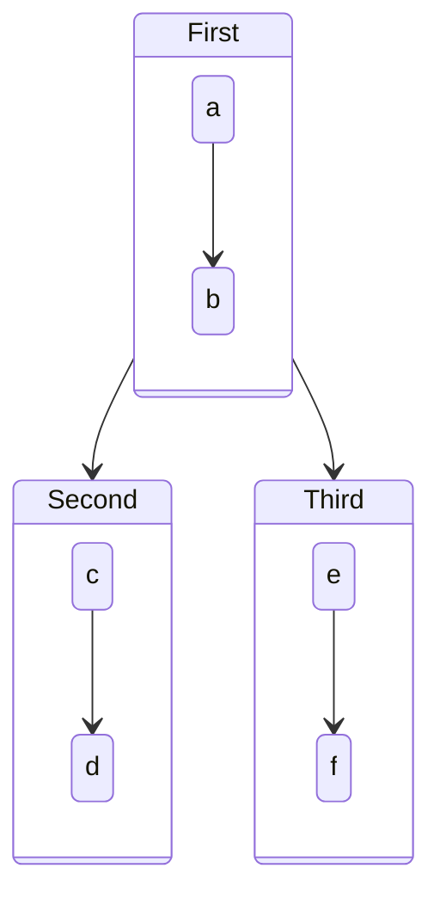
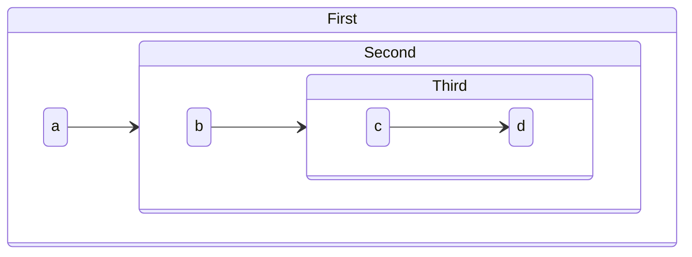
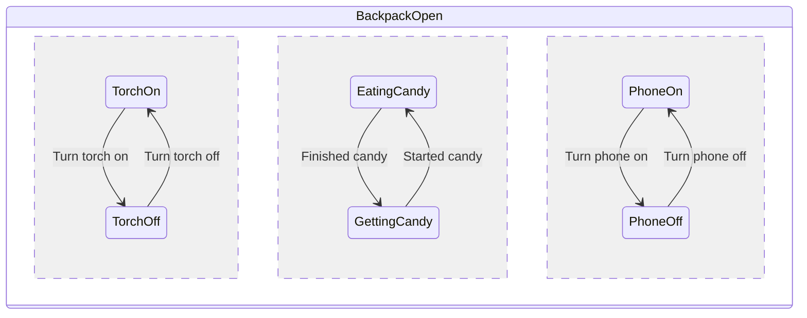
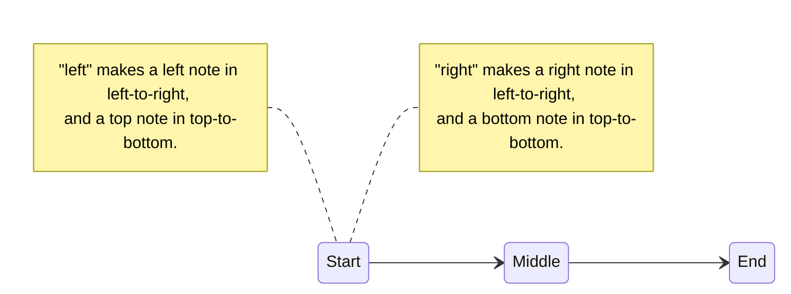
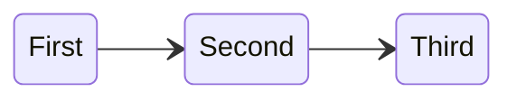

# State diagrams

## Essentials

### Basic syntax

### Direction

## Connecting states

### Simple

### Conditional (choice)

### Splits (fork / join)

## Subdiagrams

### Multiple state diagrams

### Nested state diagrams

### Concurrency

## Other

### Notes

### Comments

