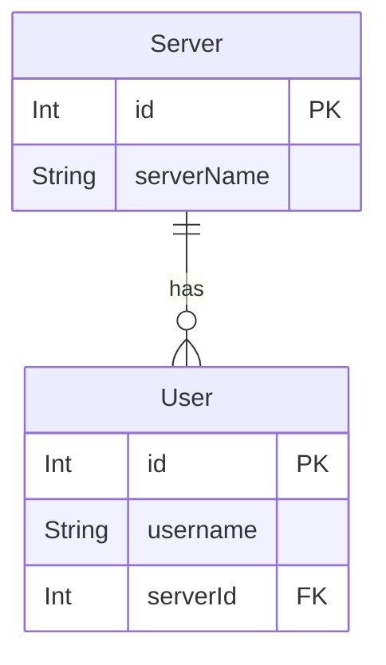
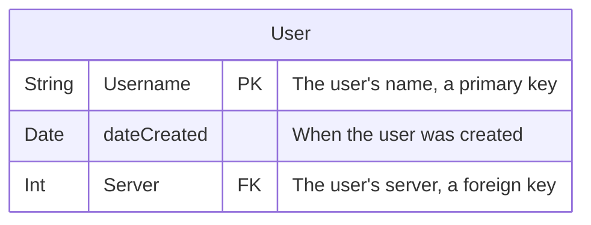
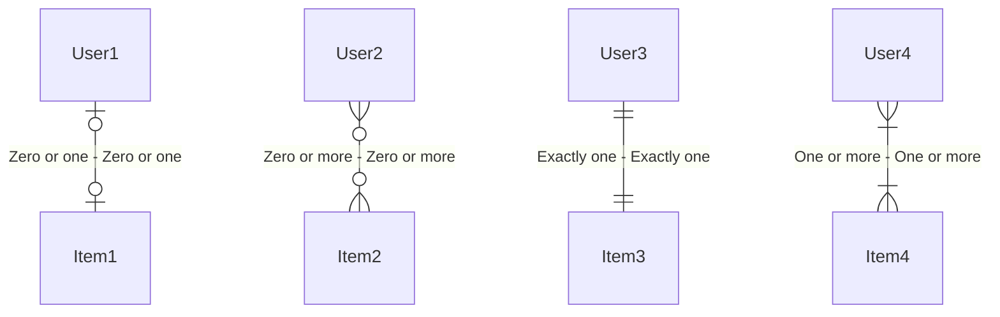
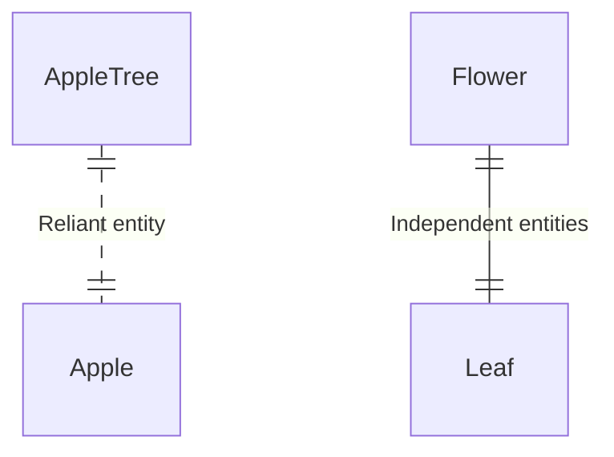

# Entity Relationship Diagrams

## Example



```
erDiagram
    User {
        Int id PK
        String username
        Int serverId FK
    }

    Server {
        Int id PK
        String serverName
    }

    Server ||--o{ User : has
```

## Defining entities



```
erDiagram
    User {
        String Username PK "The user's name, a primary key"
        Date dateCreated "When the user was created"
        Int Server FK "The user's server, a foreign key"
    }
```

## Defining relationships

### Numerical relationship



```
erDiagram
    User1 |o--o| Item1 : "Zero or one - Zero or one"
    User2 }o--o{ Item2 : "Zero or more - Zero or more"
    User3 ||--|| Item3 : "Exactly one - Exactly one"
    User4 }|--|{ Item4 : "One or more - One or more"
```

### Identifying relationship



```
erDiagram
    AppleTree ||..|| Apple : "Reliant entity"
    Flower ||--|| Leaf : "Independent entities"
```