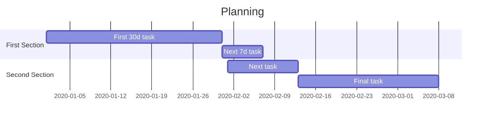
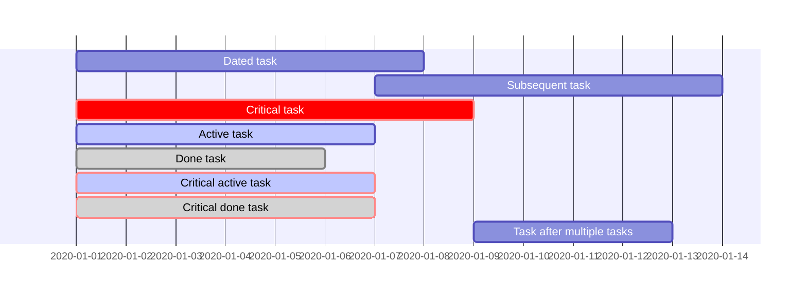
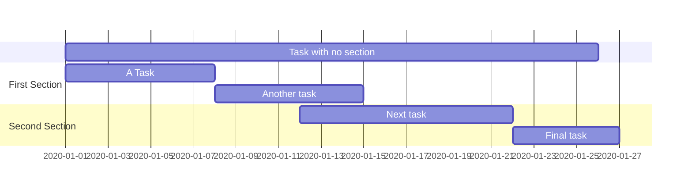
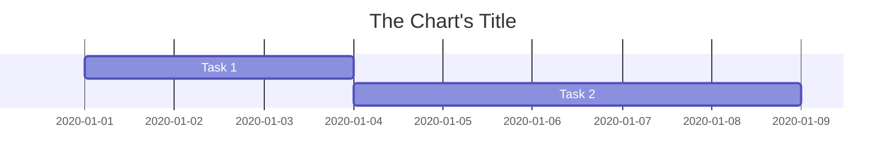
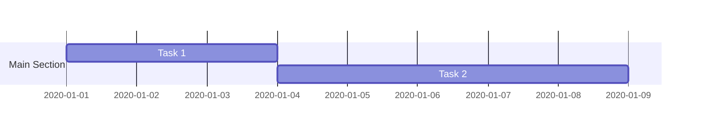

# Gantt chart



## Defining

### Defining tasks



### Defining sections



### Defining milestones & daily marker

```mermaid
gantt
    todayMarker stroke-width:5px,stroke:#0f0,opacity:0.5
    %% or `todayMarker off`
    Dated Milestone: milestone, m1, today, 3d
    Relative Milestone: milestone, m2, after m1, 5d
    Task 1: a1, today, 3d
    Task 2: a2, after a1, 5d
```

## Configuring

### Configuring date format

`dateFormat` defines the **input** date format (i.e. the format datetimes are defined in).

`axisFormat` defines the **output** date format (i.e. the format shown on the x axis).

Both have different placeholder values, see [official documentation](https://mermaid-js.github.io/mermaid/#/gantt?id=setting-dates).

```mermaid
gantt
    dateFormat HH:mm
    axisFormat %H:%M
    First Milestone: milestone, m1, 03:20, 0m
    Second Milestone: milestone, m2, 07:00, 1m
    Task 1: a1, 02:45, 2h
    Task 2: a2, after a1, 2h
```



### Configuring title



## Other

### Comments



### Links

```mermaid
gantt
    Clickable link 1: a1, 2020-01-01, 3d
    Clickable link 2: a2, after a1, 5d
    click a1 href "https://example.com"
    click a2 call "https://example.com/2"
```

JavaScript click events can also be triggered, see [official documentation](https://mermaid-js.github.io/mermaid/#/gantt?id=interaction).
### Styling

Styling is performed with CSS, see [official documentation](https://mermaid-js.github.io/mermaid/#/gantt?id=styling).