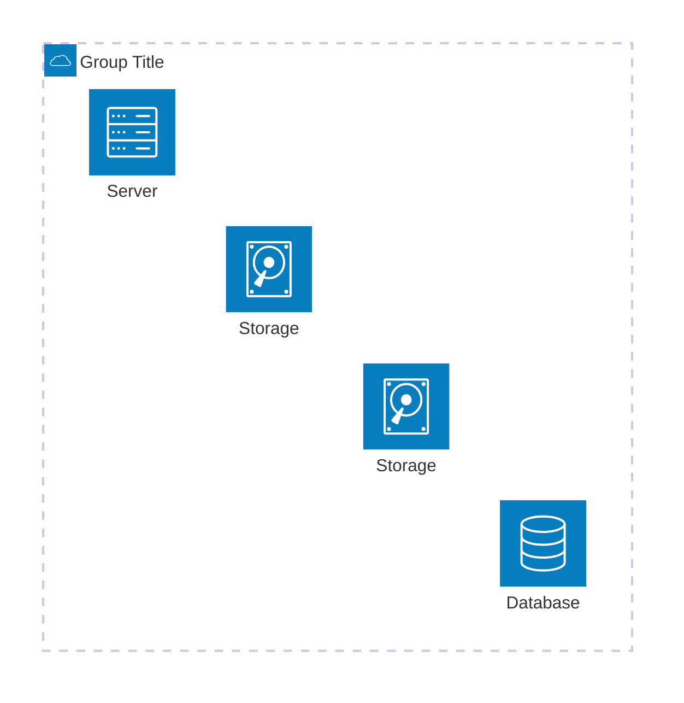
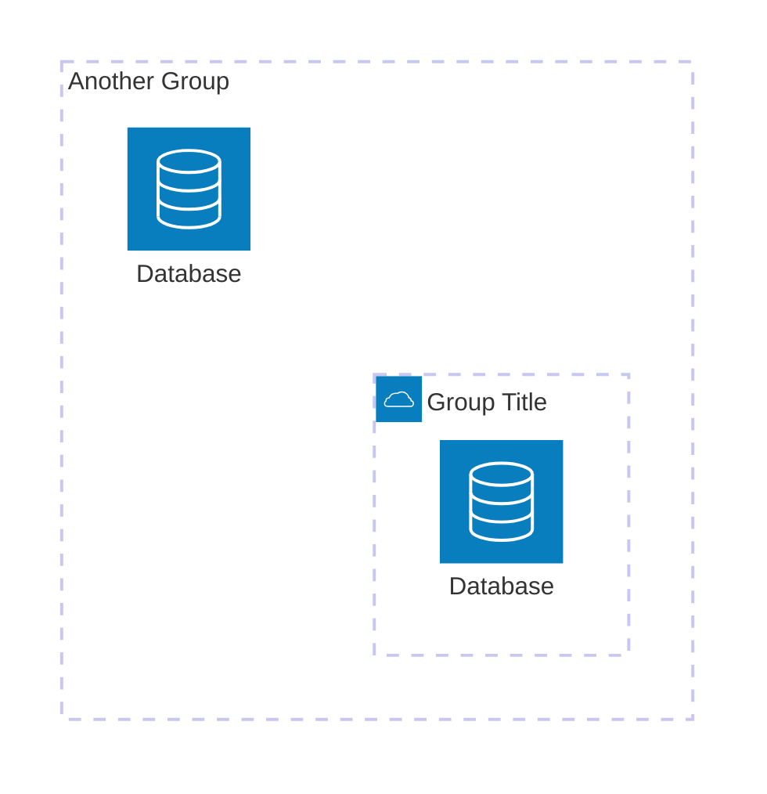
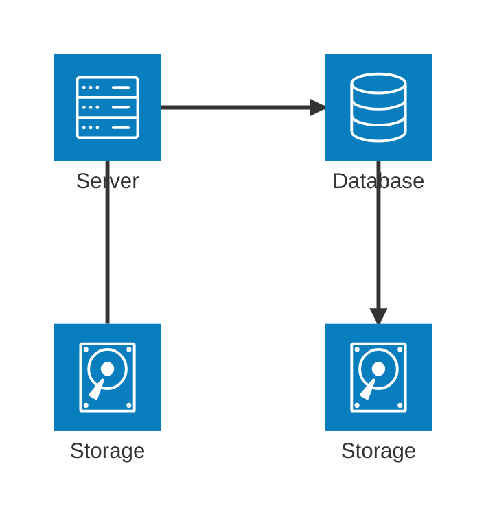
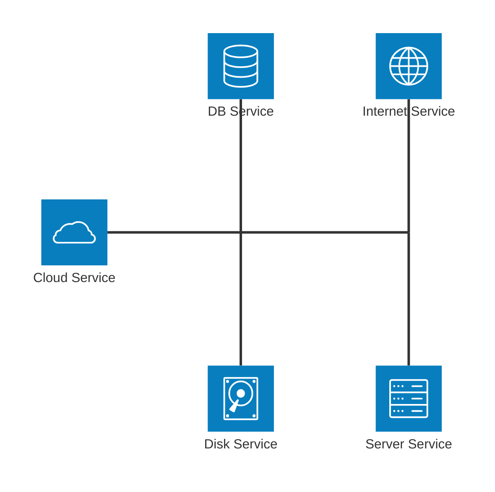

# Architecture diagrams cheatsheet

[Official documentation](https://mermaid.js.org/syntax/architecture.html).

## Basic definitions



```
architecture-beta
    group FirstGroup(cloud)[Group Title]
    service db(database)[Database] in FirstGroup
    service disk1(disk)[Storage] in FirstGroup
    service disk2(disk)[Storage] in FirstGroup
    service server(server)[Server] in FirstGroup
```

## Grouping



```
architecture-beta
    group SecondGroup[Another Group]
    group FirstGroup(cloud)[Group Title] in SecondGroup
    service db(database)[Database] in FirstGroup
    service db2(database)[Database] in SecondGroup
```

## Connections

You need to define which side of a "service" the connecting line should come out of, one of `L`eft, `R`ight, `T`op, `D`own.

Additionally, arrows on either end (`<` / `>`) are optional.



```
architecture-beta
    service db(database)[Database]
    service disk1(disk)[Storage]
    service disk2(disk)[Storage]
    service server(server)[Server]

    db:L <-- R:server
    disk1:T -- B:server
    disk2:T <-- B:db
```

## Junctions & Icons



```
architecture-beta
    service serviceA(cloud)[Cloud Service]
    service serviceB(database)[DB Service]
    service serviceC(disk)[Disk Service]
    service serviceD(internet)[Internet Service]
    service serviceE(server)[Server Service]
    junction junctionA
    junction junctionB

    serviceA:R -- L:junctionA
    serviceB:B -- T:junctionA
    serviceC:T -- B:junctionA
    serviceD:B -- T:junctionB
    junctionA:R -- L:junctionB
    serviceE:T -- B:junctionB
```

## Additional icons

All icons from the Iconify ["Logos" set](https://icon-sets.iconify.design/logos/?keyword=logos) are built-in.

```mermaid
architecture-beta
    service a(logos:aws-lambda)[AWS Lambda]
    service b(logos:github-actions)[GitHub Actions]
    service d(logos:google)[Google]
    service e(logos:adyen)[Adyen]
```



```
architecture-beta
    service a(logos:aws-lambda)[AWS Lambda]
    service b(logos:github-actions)[GitHub Actions]
    service d(logos:google)[Google]
    service e(logos:adyen)[Adyen]
```
