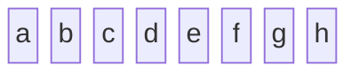
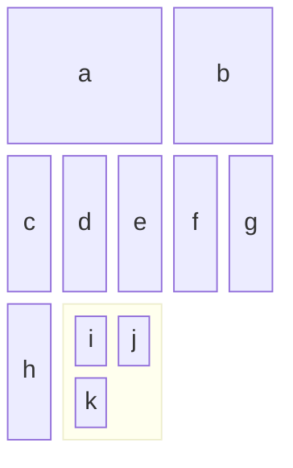
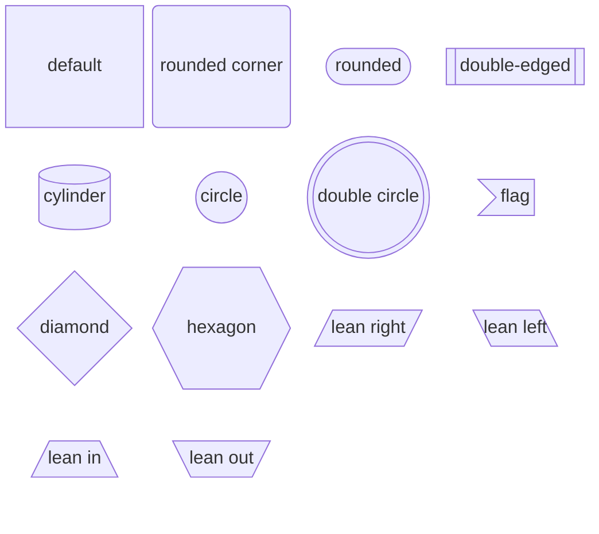
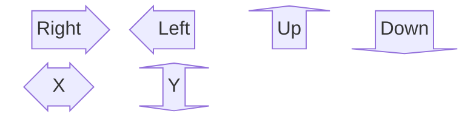
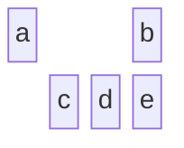
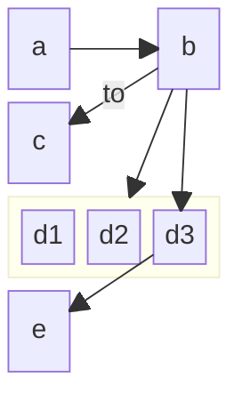
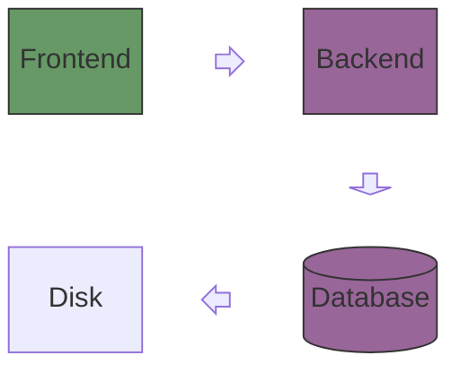

# Block diagrams cheatsheet

[Official documentation](https://mermaid.js.org/syntax/block.html).

## Basic blocks



```
block-beta
    a b c d e f g h
```

## Block widths, columns, and groups

You can define the overall column count, the per-block column width, and include blocks within blocks.

Note that for `myBlock`, the first `2` states the columns it should cover, and the `columns 2` covers how many columns it includes.



```
block-beta
    columns 5
    a:3 b:2 c d e f g h
    block:myBlock:2
        columns 2
        i j k
    end
```

## Block shapes



```
block-beta
    columns 4
    a["default"]
    b("rounded corner")
    c(["rounded"])
    d[["double-edged"]]
    e[("cylinder")]
    f(("circle"))
    g((("double circle")))
    h>"flag"]
    i{"diamond"}
    j{{"hexagon"}}
    k[/"lean right"/]
    l[\"lean left"\]
    m[/"lean in"\]
    n[\"lean out"/]
```

## Block arrows



```
block-beta
    columns 4
    a<["Right"]>(right)
    b<["Left"]>(left)
    c<["Up"]>(up)
    d<["Down"]>(down)
    e<["X"]>(x)
    f<["Y"]>(y)
```

## Space blocks



```
block-beta
    columns 4
    a space:2 b
    space:1 c d e
```

## Connecting blocks

Note that defining a block before connecting it is not required, but it can be useful to ensure there is enough spacing. You can also connect across rows / columns / nesting blocks.



```
block-beta
    columns 3
    a space b
    c space:2
    block:d:3
        d1 d2 d3
    end
    e
    a-->b
    b--"to"-->c
    b-->d
    b-->d3
    d3-->e
```

## Styling

Mermaid [provides an example](https://mermaid.js.org/syntax/block.html#example-system-architecture) of combining decorative arrow blocks with fill colours, creating a complex flow:



```
block-beta
  columns 3
  Frontend blockArrowId6<[" "]>(right) Backend
  space:2 down<[" "]>(down)
  Disk left<[" "]>(left) Database[("Database")]

  classDef front fill:#696,stroke:#333;
  classDef back fill:#969,stroke:#333;
  class Frontend front
  class Backend,Database back
```
