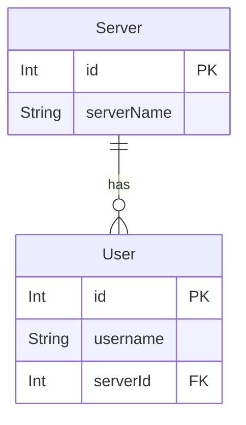
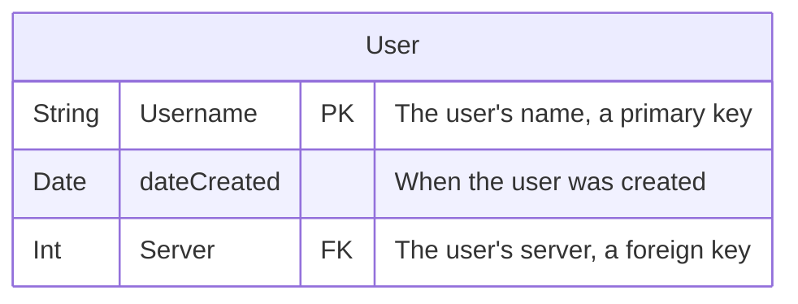
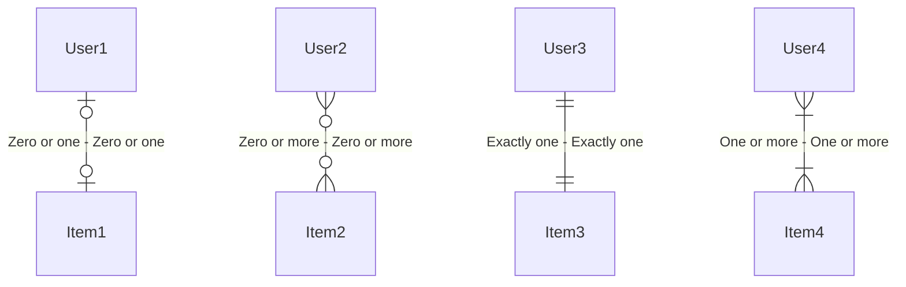
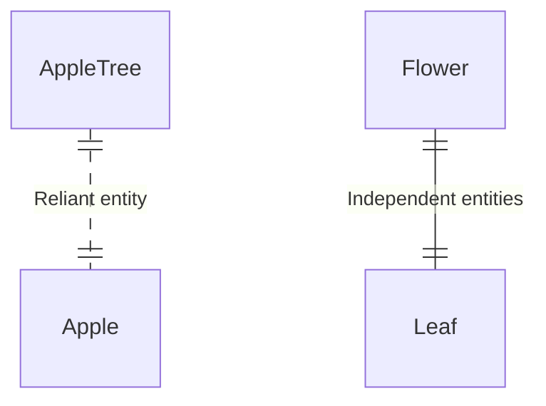

# Entity relationship diagrams cheatsheet

[Official documentation](https://mermaid-js.github.io/mermaid/#/entityRelationshipDiagram) & [live editor](https://mermaid-js.github.io/mermaid-live-editor/edit#pako:eNp9kdFqwyAUhl9FznXTB8hdiTIC6xwmLRS8cXq6ypJYrCmMJO8-syVbs5V5p-f7zn_kdKCdQUgBPbXq1ataNuT7ZLui5FsmyNCv131HKHvM90wckg2lghUFSclJXe4afZ8kriNc0HhJyblSGv8l86c9zzMWWQmVVS8VkqPzEm6dP_m_UjxqtNdlztx3RPsfVLsr-gX4VbnFkrxk28jaRletWbZ9FpzusjLJNiV74OIwi9P7Z0ITlG3uWYu55xQJzhv0aGLe8tuEwApq9LWyJq6qG2sSwglrlDCKRvm3URki156NCsiMDc5DelTVBVeg2uCK90ZDGnyLMzRtfKKGDwePlnE).

## Example



```
erDiagram
    User {
        Int id PK
        String username
        Int serverId FK
    }

    Server {
        Int id PK
        String serverName
    }

    Server ||--o{ User : has
```

## Defining entities



```
erDiagram
    User {
        String Username PK "The user's name, a primary key"
        Date dateCreated "When the user was created"
        Int Server FK "The user's server, a foreign key"
    }
```

## Defining relationships

### Numerical relationship



```
erDiagram
    User1 |o--o| Item1 : "Zero or one - Zero or one"
    User2 }o--o{ Item2 : "Zero or more - Zero or more"
    User3 ||--|| Item3 : "Exactly one - Exactly one"
    User4 }|--|{ Item4 : "One or more - One or more"
```

### Identifying relationship



```
erDiagram
    AppleTree ||..|| Apple : "Reliant entity"
    Flower ||--|| Leaf : "Independent entities"
```