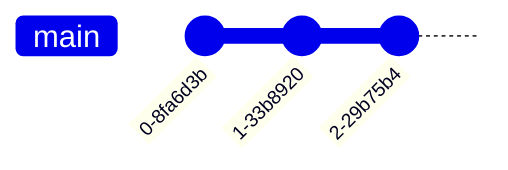

# Git graphs cheatsheet

[Live editor](https://mermaid-js.github.io/mermaid-live-editor/edit#pako:eNplj7EOwjAMRH-l8twBBpbMIHZYvZjEtBHEqVJHCFX9d0JLURFebN09WXcD2OgYDDRej4m61qDETn2UHmVAqcogSGHOHVkvDYKptrtNvbZO5HzuJ2eDMqKwOBQbQ_CKckkktq2EH_NVnJbtLWb90T70dy9MoF45_QOBU8PrD1BD0QJ5V-pM0RG05cDvYAiOr5TvilASFjR3jpQPzmtMYK5077kGyhrPT7FgNGVeoL2nJlGYxfEF4jtu2A).

## Basic graph



```
gitGraph:
    commit
    commit
    commit
```

## Branching, checking out, and merging


```
gitGraph:
    commit
    branch branch2
    checkout branch2
    commit
    checkout main
    commit
    merge branch2
```

## Notes

* There is no official documentation yet for git graphs.
* The git commits seem to change frequently, and cannot be specified.
