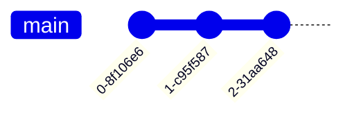

# Git graphs cheatsheet

[Official documentation](https://mermaid.js.org/syntax/gitgraph.html).

## Basic graph



```
gitGraph:
    commit
    commit
    commit
```

## Branching, checking out, and merging


```
gitGraph:
    commit
    branch branch2
    checkout branch2
    commit
    checkout main
    commit
    merge branch2
```

## Notes

- There is no official documentation yet for git graphs.
- The git commits seem to change frequently, and cannot be specified.
