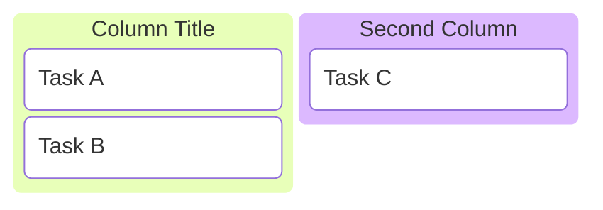
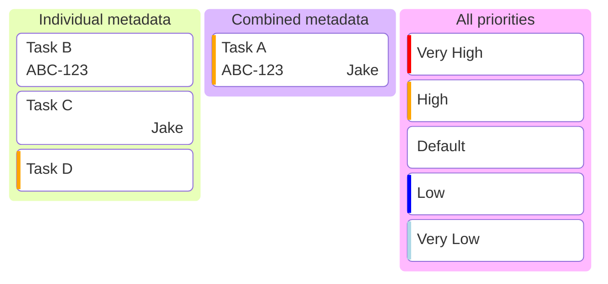

# Kanban diagram cheatsheet

[Official documentation](https://mermaid.js.org/syntax/kanban.html).

## Defining



```
kanban
    Column Title
        Task A
        Task B
    Second Column
        Task C
```

## Metadata



```
kanban
    Individual metadata
        Task B@{ ticket: ABC-123 }
        Task C@{ assigned: 'Jake' }
        Task D@{ priority: 'High' }
    Combined metadata
        Task A@{ ticket: ABC-123, assigned: 'Jake', priority: 'High' }
    All priorities
        Very High@{ priority: 'Very High' }
        High@{ priority: 'High' }
        Default
        Low@{ priority: 'Low' }
        Very Low@{ priority: 'Very Low' }
```
