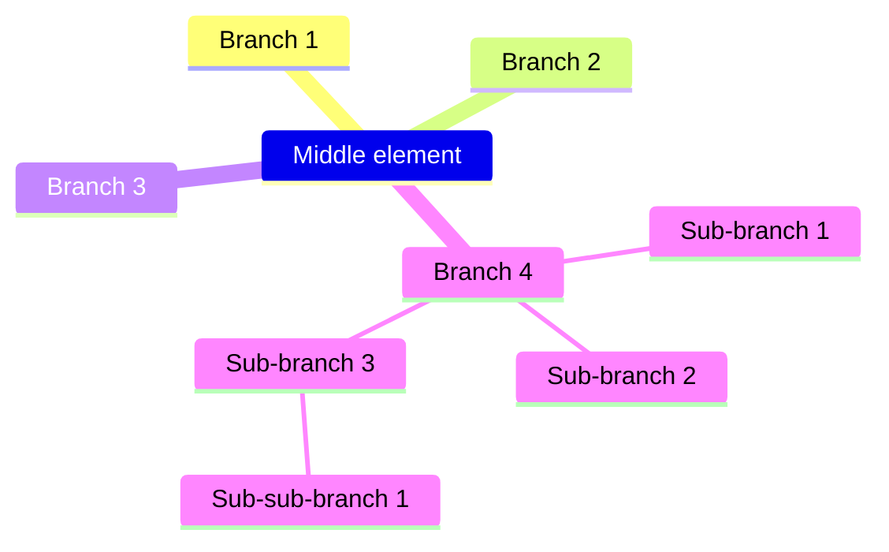
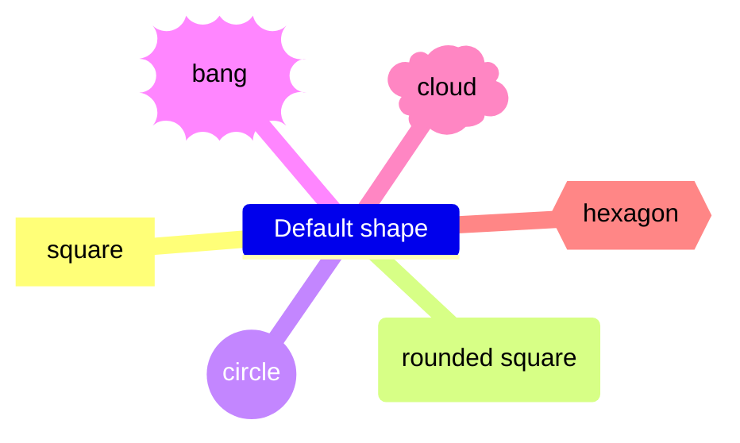
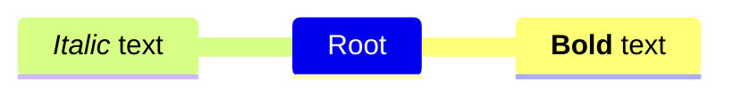

# Minmap charts cheatsheet

[Official documentation](https://mermaid.js.org/syntax/mindmap.html).

## Defining

The structure is essentially identical to a Markdown list, with indentation forming all the logic:



```
mindmap
    Middle element
        Branch 1
        Branch 2
        Branch 3
        Branch 4
            Sub-branch 1
            Sub-branch 2
            Sub-branch 3
                Sub-sub-branch 1
```

## Shapes

You can shape each element within the mindmap:



```
mindmap
    Default shape
        [square]
        (rounded square)
        ((circle))
        ))bang((
        )cloud(
        {{hexagon}}
```

## Icons & Markdown

Each element can also add custom icons, if using an icon pack like Font Awesome (`fa fa-x`) or Material Design (`mdi mdi-x`). These **will not work directly on GitHub** without additional configuration (including stylesheets).

Additionally, basic Markdown formatting (bold & italic) works within node names:



```
mindmap
    Root
        **Bold** text
        ::icon(fa fa-book)
        *Italic* text
        ::icon(mdi mdi-skull-outline)
```
