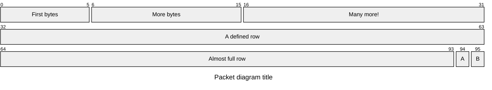

# Packet diagram cheatsheet

[Official documentation](https://mermaid.js.org/syntax/packet.html).

Packet diagrams ensure all bytes must be defined, by displaying an error if there are any gaps, or overlaps, in the byte numbers. Additionally, each row will have 32 bytes defined (e.g. 0-31).

## Defining



```
packet-beta
    title Packet diagram title
    0-5: "First bytes"
    6-15: "More bytes"
    16-31: "Many more!"
    32-63: "A defined row"
    64-93: "Almost full row"
    94: "A"
    95: "B"
```
