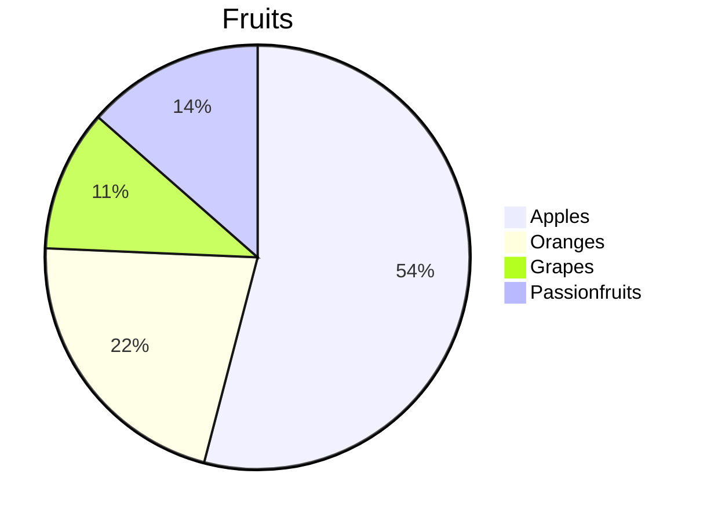

# Pie charts cheatsheet

[Official documentation](https://mermaid-js.github.io/mermaid/#/pie) & [live editor](https://mermaidjs.github.io/mermaid-live-editor/#/edit/eyJjb2RlIjoicGllXG5cIkRvZ3NcIiA6IDQyLjk2XG5cIkNhdHNcIiA6IDUwLjA1XG5cIlJhdHNcIiA6IDEwLjAxIiwibWVybWFpZCI6eyJ0aGVtZSI6ImRlZmF1bHQifX0).

## Defining



```
pie
    title Fruits
    "Apples" : 50
    "Oranges" : 20
    "Grapes" : 9.99
    "Passionfruits" : 12.5
```