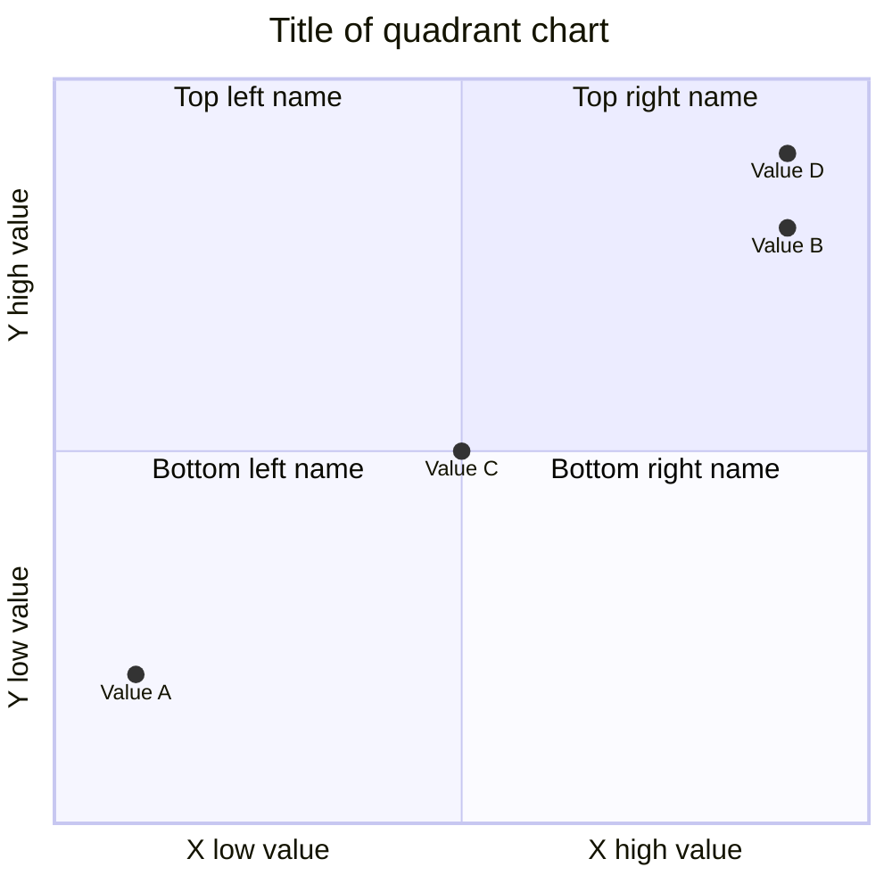
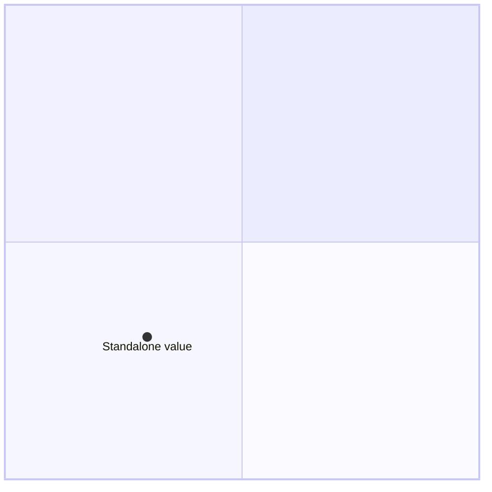
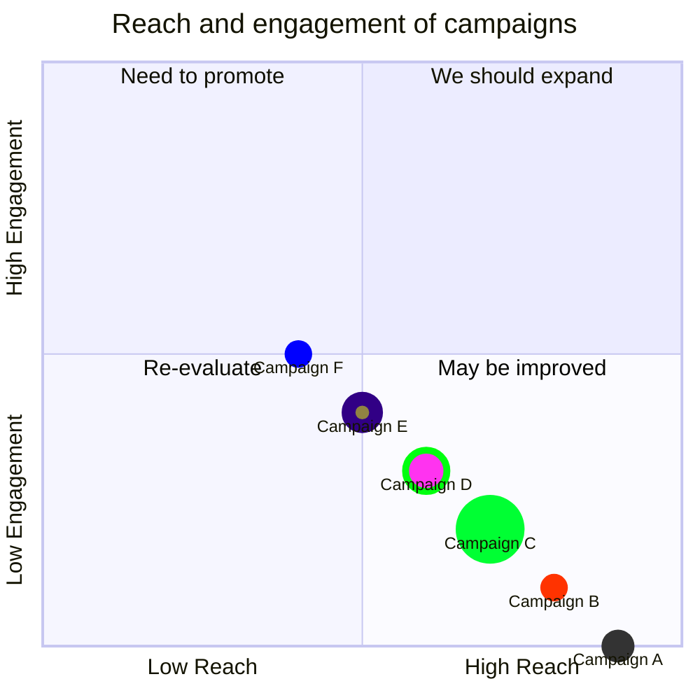

# Quadrant charts cheatsheet

[Official documentation](https://mermaid.js.org/syntax/quadrantChart.html).

## Standard definition



```
quadrantChart
    title Title of quadrant chart
    x-axis X low value --> X high value
    y-axis Y low value --> Y high value
    quadrant-1 Top right name
    quadrant-2 Top left name
    quadrant-3 Bottom left name
    quadrant-4 Bottom right name
    Value A: [0.1, 0.2]
    Value B: [0.9, 0.8]
    Value C: [0.5, 0.5]
    Value D: [0.9, 0.9]
```

## Minimal definition



```
quadrantChart
    Standalone value: [0.3, 0.3]
```

## Styling

There is a complex [chart](https://mermaid.js.org/syntax/quadrantChart.html#chart-configurations) & [quadrant](https://mermaid.js.org/syntax/quadrantChart.html#chart-theme-variables) styling system for Quadrant charts, I'd recommend using the official docs!

Here's a complex, fully themed example using classes:



```
quadrantChart
  title Reach and engagement of campaigns
  x-axis Low Reach --> High Reach
  y-axis Low Engagement --> High Engagement
  quadrant-1 We should expand
  quadrant-2 Need to promote
  quadrant-3 Re-evaluate
  quadrant-4 May be improved
  Campaign A: [0.9, 0.0] radius: 12
  Campaign B:::class1: [0.8, 0.1] color: #ff3300, radius: 10
  Campaign C: [0.7, 0.2] radius: 25, color: #00ff33, stroke-color: #10f0f0
  Campaign D: [0.6, 0.3] radius: 15, stroke-color: #00ff0f, stroke-width: 5px ,color: #ff33f0
  Campaign E:::class2: [0.5, 0.4]
  Campaign F:::class3: [0.4, 0.5] color: #0000ff
  classDef class1 color: #109060
  classDef class2 color: #908342, radius : 10, stroke-color: #310085, stroke-width: 10px
  classDef class3 color: #f00fff, radius : 10
```
