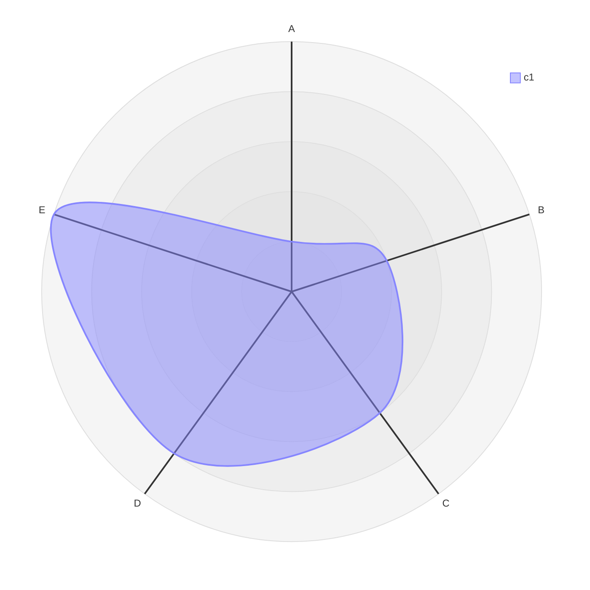
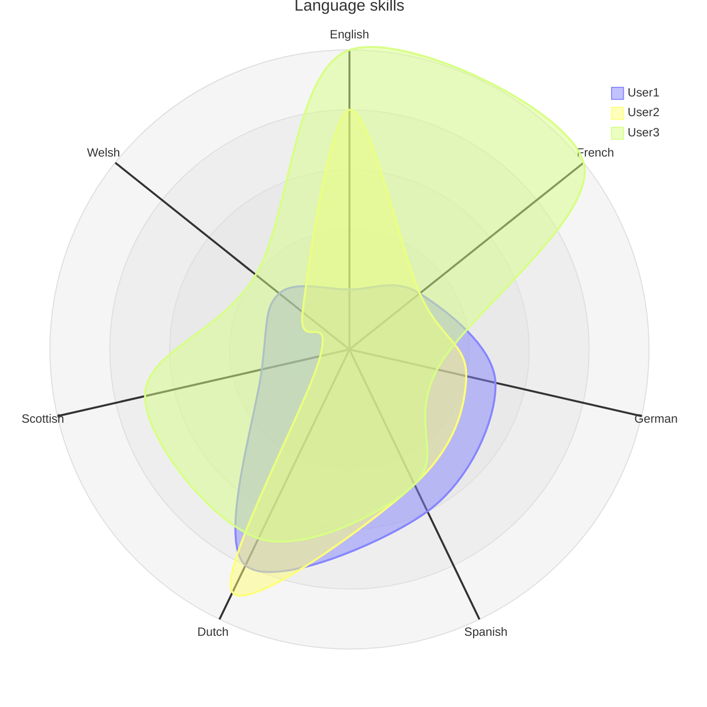
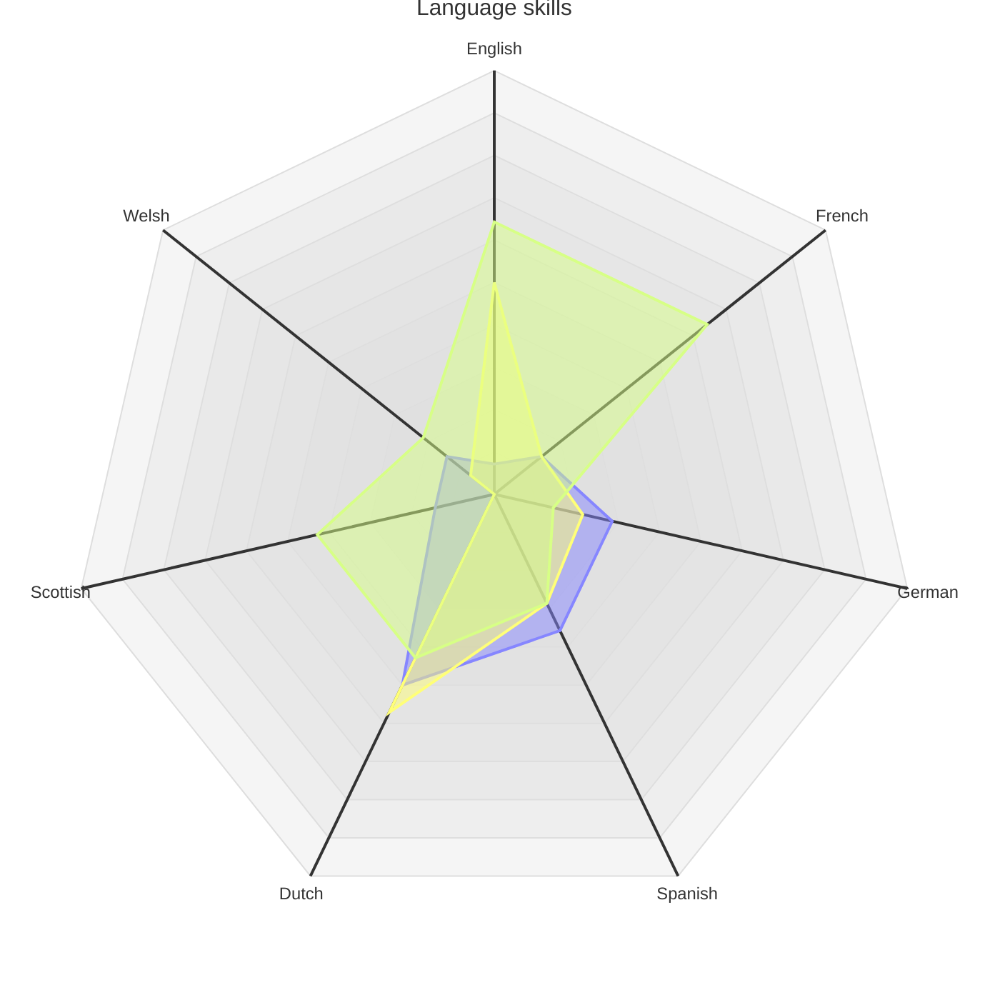
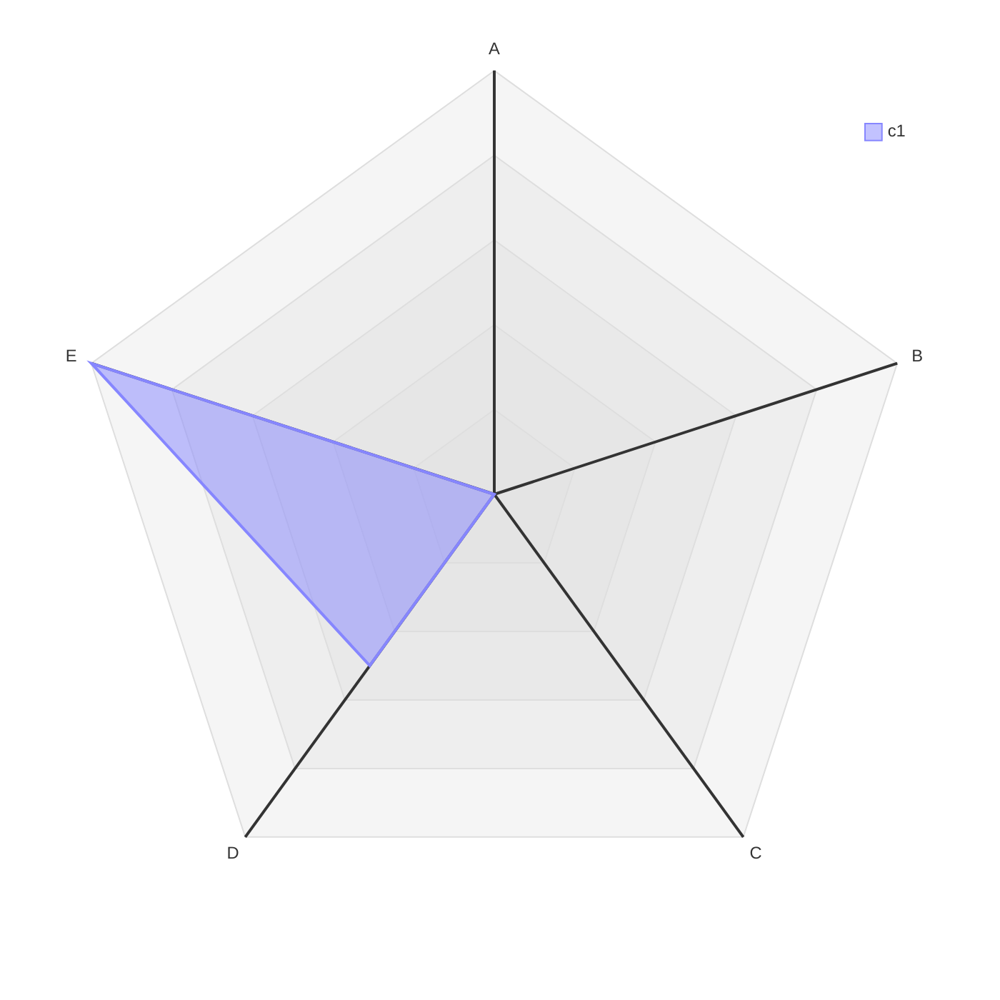
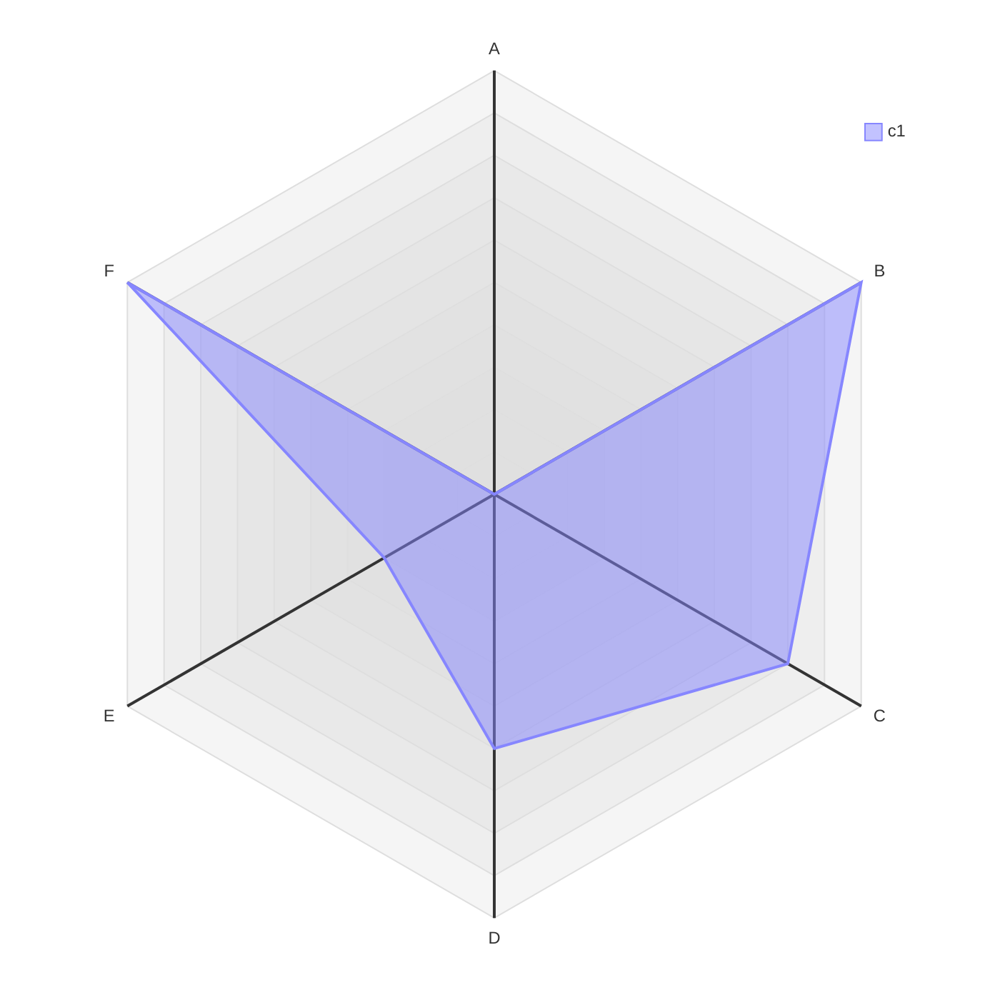

# Radar diagram cheatsheet

[Official documentation](https://mermaid.js.org/syntax/radar.html).

## Basic definition



```
radar-beta
    axis A, B, C, D, E
    curve c1{1,2,3,4,5}
```

## Annotated definition



```
radar-beta
    title Language skills
    axis English, French, German, Spanish, Dutch, Scottish, Welsh
    curve a["User1"]{20, 30, 50, 60, 80, 30, 30}
    curve b["User2"]{80, 30, 40, 50, 90, 10, 20}
    curve c["User3"]{100, 100, 30, 50, 70, 70, 40}
```

## Configuration options

Note that combining `max`, `min`, and `ticks` can be useful for "hiding" low data, making anomalously high values more obvious.



```
radar-beta
    title Language skills
    axis English, French, German, Spanish, Dutch, Scottish, Welsh
    curve a["User1"]{20, 30, 50, 60, 80, 30, 30}
    curve b["User2"]{80, 30, 40, 50, 90, 10, 20}
    curve c["User3"]{100, 100, 30, 50, 70, 70, 40}

    showLegend false
    min 10
    max 150
    graticule polygon
    ticks 10
```

## Hiding data

Combining `max`, `min`, and `ticks` can be useful for "hiding" low data, making anomalously high values more obvious. When doing this, `graticule polygon` should be used to avoid odd lines.

For example, if we only care about values >3 in our initial diagram:



```
radar-beta
    axis A, B, C, D, E
    curve c1{1,2,3,4,5}

    min 3
    graticule polygon
```

This can be taken even further, if we only care about a narrow subsection of data (e.g. between 70 and 80):



```
radar-beta
    axis A, B, C, D, E
    curve c1{1,2,3,4,5}

    min 3
    graticule polygon
```

## Styling

There is [additional configuration](https://mermaid.js.org/syntax/radar.html#configuration) for the radar diagram, curves, and more.
