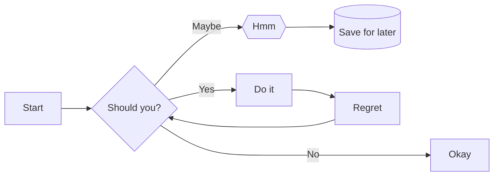
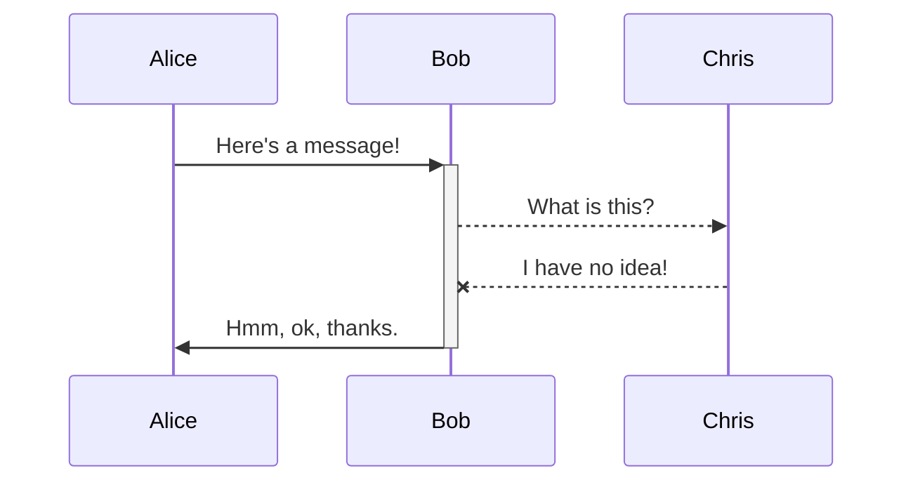

# Mermaid syntax references

A concise rewrite of [the mermaid documentation](https://mermaid-js.github.io/mermaid/) for quick lookups.

Meta:
* Overview (comments, configuring, etc)

<table>
<tr><td>Example</td><td>Code</td></tr>

<tr><td>



</td><td>

```
flowchart TD
    A[Start] --> B{Should you?}
    B -- Yes --> C[Do it]
    B -- Maybe --> F{{Hmm}} --> G[(Save for later)]
    C --> D[Regret]
    D --> B
    B -- No ----> E[Okay]
```
<a href="/1-flowchart.md">1: Flowchart</a>
</td></tr>
<tr><td>



</td><td>

```
sequenceDiagram
    Alice ->>+ Bob: Here's a message!
    Bob -->> Chris: What is this?
    Chris --x Bob: I have no idea!
    Bob ->>- Alice: Hmm, ok, thanks.
```
<a href="/2-sequence.md">2: Sequence</a>
</td></tr>
<tr><td>
</td><td>
<a href="/3-class.md">3: Class</a></td></tr>
<tr><td>
</td><td>
<a href="/4-state.md">4: State</a></td></tr>
<tr><td>
</td><td>
<a href="/5-entity-relationship.md">5: Entity Relationship</a></td></tr>
<tr><td>
</td><td>
<a href="/6-user-journey.md">6: User Journey</a></td></tr>
<tr><td>
</td><td>
<a href="/7-gantt.md">7: Gantt</a></td></tr>
<tr><td>
</td><td>
<a href="/8-pie.md">8: Pie</a></td></tr>
<tr><td>
</td><td>
<a href="/9-requirement">9: Requirement</a></td></tr>
<tr><td>
</td><td>
<a href="/10-others.md">10: Others</a></td></tr>

</table>