> [!TIP]  
> **Last updated Apr 2025** to include Quadrant, C4, Mindmap, ZenUML, Timeline, Sankey, XY, Block, Architecture, Kanban, Packet, and Radar diagrams!

# Mermaid syntax references

A rewrite of [the Mermaid documentation](https://mermaid.js.org/intro/syntax-reference.html) as a learning aid and cheatsheet.

<table>
<tr><td>Example</td><td>Code</td></tr>

<tr><td>

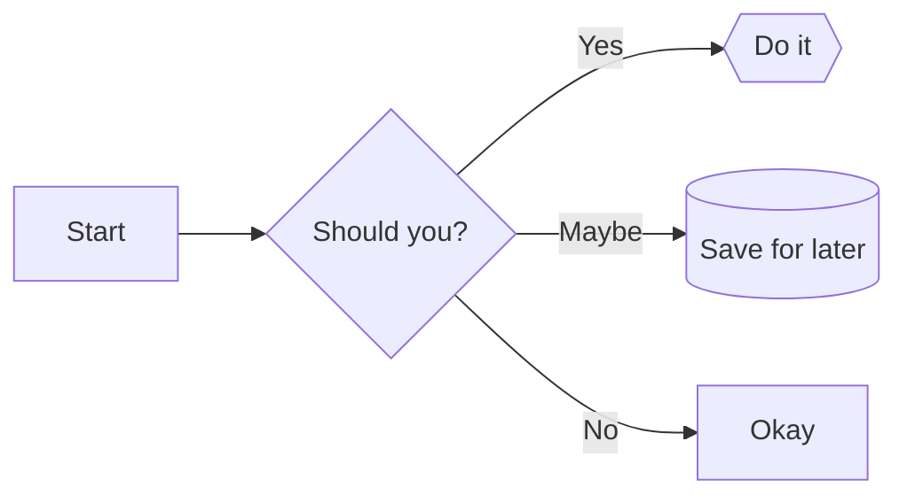

</td><td>

```
flowchart LR
    A[Start] --> B{Should you?}
    B -- Yes --> C{{Do it}}
    B -- Maybe --> D[(Save for later)]
    B -- No --> E[Okay]
```

<a href="/flowchart.md">Flowchart in Mermaid cheatsheet</a>

</td></tr>
<tr><td>

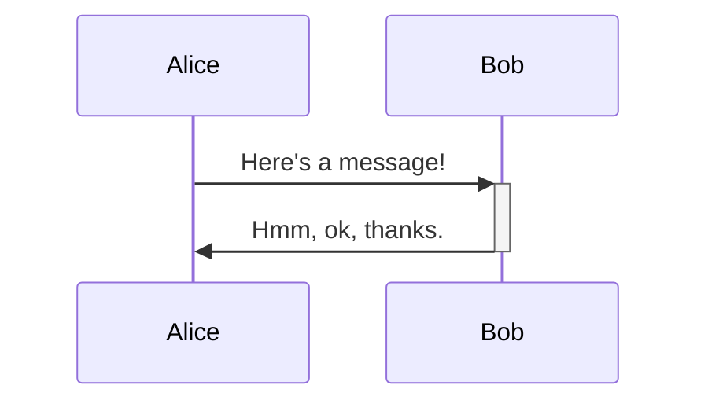

</td><td>

```
sequenceDiagram
    Alice ->>+ Bob: Here's a message!
    Bob ->>- Alice: Hmm, ok, thanks.
```

<a href="/sequence.md">Sequence diagram in Mermaid cheatsheet</a>

</td></tr>
<tr><td>

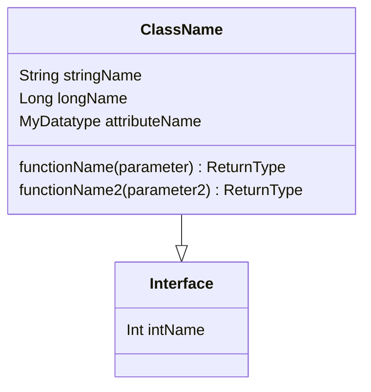

</td><td>

```
classDiagram
    class ClassName {
        String stringName
        Long longName
        MyDatatype attributeName

        functionName(parameter) ReturnType
        functionName2(parameter2) ReturnType
    }
    class Interface {
        Int intName
    }
    ClassName --|> Interface
```

<a href="/class.md">Class diagram in Mermaid cheatsheet</a></td></tr>

<tr><td>

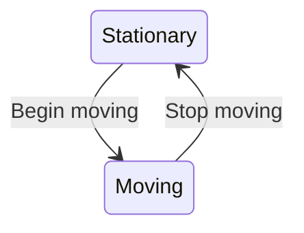

</td><td>

```
stateDiagram-v2
    Stationary --> Moving : Begin moving
    Moving --> Stationary : Stop moving
```

<a href="/state.md">State diagram in Mermaid cheatsheet</a></td></tr>

<tr><td>

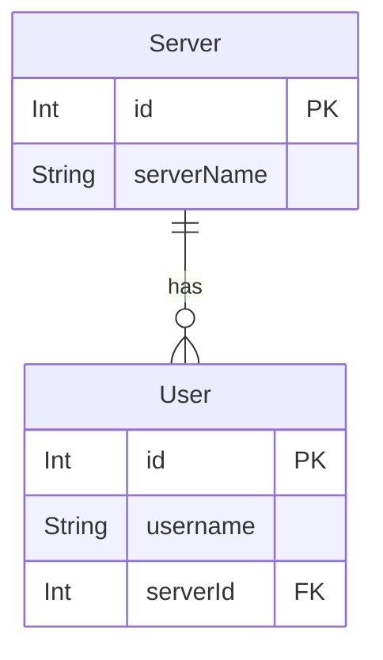

</td><td>

```
erDiagram
    User {
        Int id PK
        String username
        Int serverId FK
    }

    Server {
        Int id PK
        String serverName
    }

    Server ||--o{ User : has
```

<a href="/entity-relationship.md">Entity relationship diagram in Mermaid cheatsheet</a></td></tr>

<tr><td>

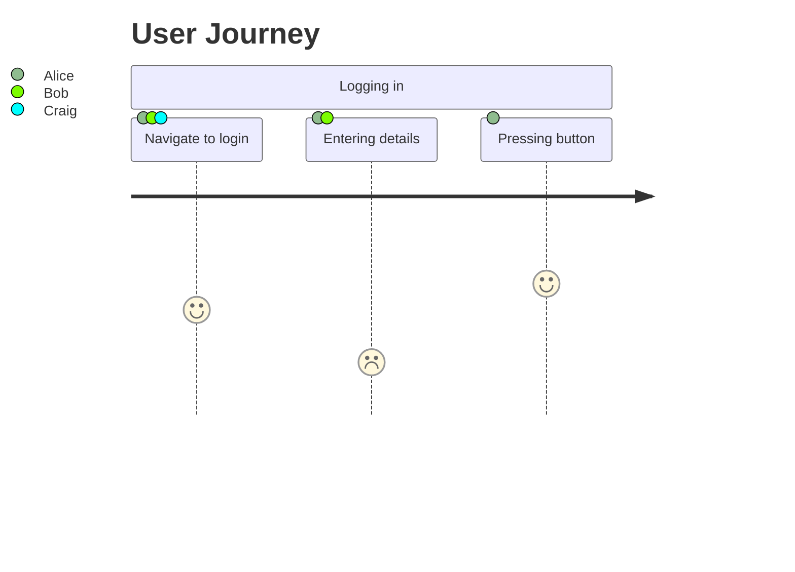

</td><td>

```
journey
    title User Journey
    section Logging in
        Navigate to login: 4: Alice, Bob, Craig
        Entering details: 2: Alice, Bob
        Pressing button: 5: Alice
```

<a href="/user-journey.md">User journey diagram in Mermaid cheatsheet</a></td></tr>

<tr><td>

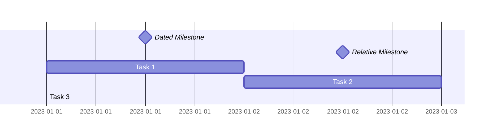

</td><td>

```
gantt
    Dated Milestone: milestone, m1, 2023-01-01, 1d
    Relative Milestone: milestone, m2, after m1, 1d
    Task 1: a1, 2023-01-01, 1d
    Task 2: a2, after a1, 1d
    Task 3: a3, 2023-01-01, 36hr
```

<a href="/gantt.md">Gantt chart in Mermaid cheatsheet</a></td></tr>

<tr><td>

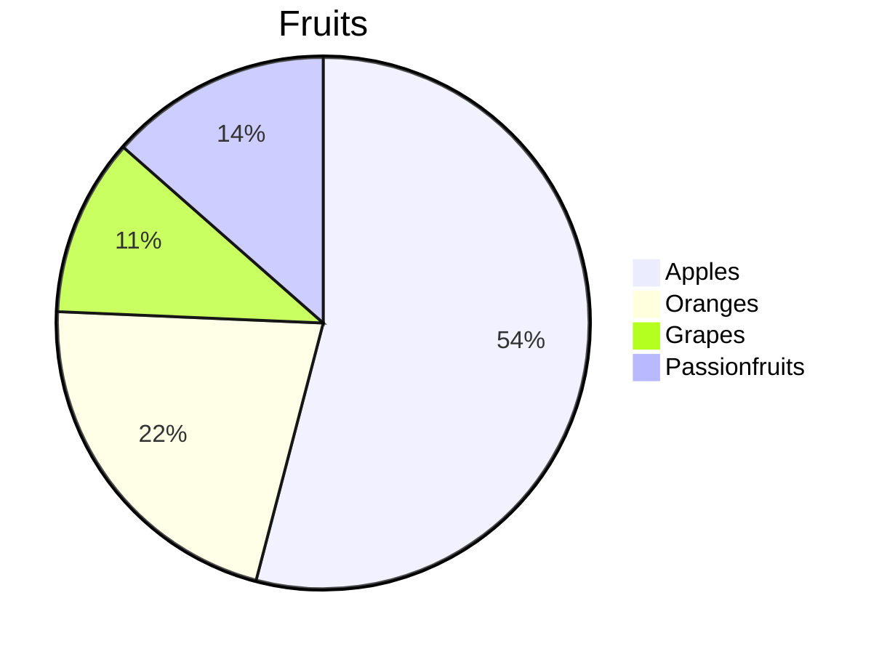

</td><td>

```
pie
    title Fruits
    "Apples" : 50
    "Oranges" : 20
    "Grapes" : 9.99
    "Passionfruits" : 12.5
```

<a href="/pie.md">Pie chart in Mermaid cheatsheet</a></td></tr>

<tr><td>

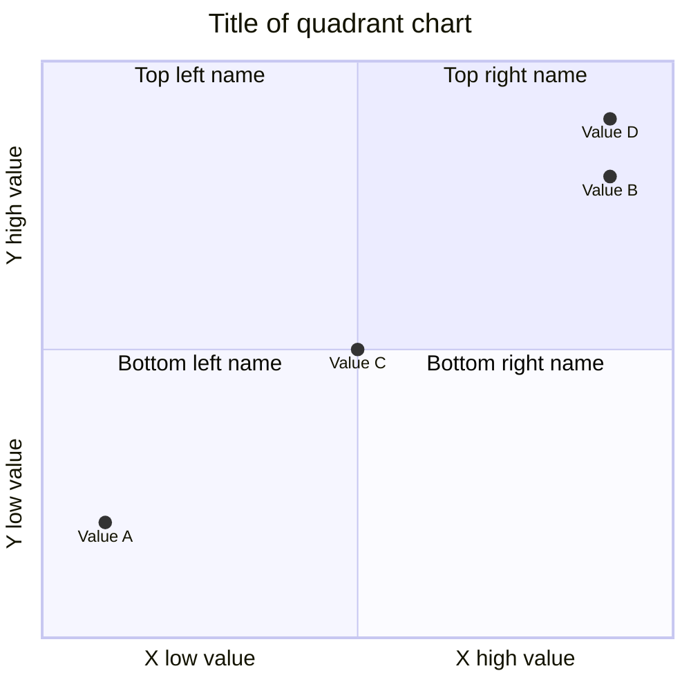

</td><td>

```
quadrantChart
    title Title of quadrant chart
    x-axis X low value --> X high value
    y-axis Y low value --> Y high value
    quadrant-1 Top right name
    quadrant-2 Top left name
    quadrant-3 Bottom left name
    quadrant-4 Bottom right name
    Value A: [0.1, 0.2]
    Value B: [0.9, 0.8]
    Value C: [0.5, 0.5]
    Value D: [0.9, 0.9]
```

<a href="/quadrant.md">Quadrant diagram in Mermaid cheatsheet</a></td></tr>

<tr><td>

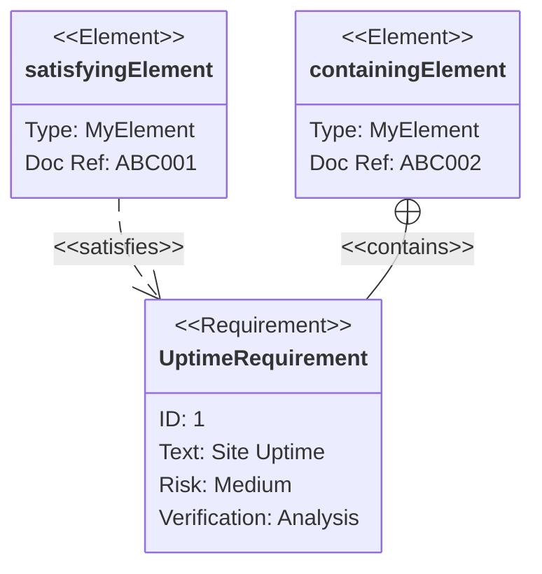

</td><td>

```
    requirementDiagram

    requirement UptimeRequirement {
        id: 1
        text: Site Uptime
        risk: Medium
        verifymethod: Analysis
    }

    element satisfyingElement {
        type: MyElement
        docref: ABC001
    }

    element containingElement {
        type: MyElement
        docref: ABC002
    }

    satisfyingElement - satisfies -> UptimeRequirement
    containingElement - contains -> UptimeRequirement
```

<a href="/requirement.md">Requirement diagram in Mermaid cheatsheet</a></td></tr>

<tr><td>

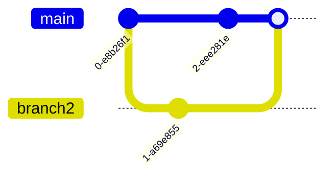

</td><td>

```
gitGraph:
    commit
    branch branch2
    checkout branch2
    commit
    checkout main
    commit
    merge branch2
```

<a href="/git.md">Git graphs in Mermaid cheatsheet</a></td></tr>

<tr><td>

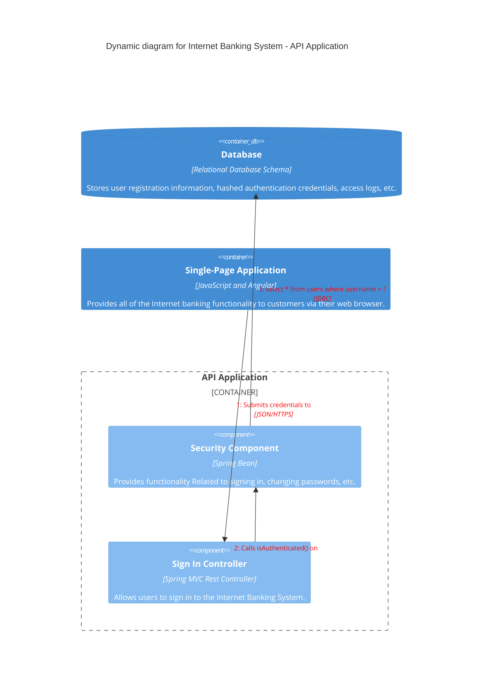

</td><td>

```
C4Dynamic
    title Dynamic diagram for Internet Banking System - API Application

    ContainerDb(c4, "Database", "Relational Database Schema", "Stores user registration information, hashed authentication credentials, access logs, etc.")
    Container(c1, "Single-Page Application", "JavaScript and Angular", "Provides all of the Internet banking functionality to customers via their web browser.")
    Container_Boundary(b, "API Application") {
      Component(c3, "Security Component", "Spring Bean", "Provides functionality Related to signing in, changing passwords, etc.")
      Component(c2, "Sign In Controller", "Spring MVC Rest Controller", "Allows users to sign in to the Internet Banking System.")
    }
    Rel(c1, c2, "Submits credentials to", "JSON/HTTPS")
    Rel(c2, c3, "Calls isAuthenticated() on")
    Rel(c3, c4, "select * from users where username = ?", "JDBC")

    UpdateRelStyle(c1, c2, $textColor="red", $offsetY="-40")
    UpdateRelStyle(c2, c3, $textColor="red", $offsetX="-40", $offsetY="60")
    UpdateRelStyle(c3, c4, $textColor="red", $offsetY="-40", $offsetX="10")
```

<a href="/c4.md">C4 diagram in Mermaid cheatsheet</a></td></tr>

<tr><td>

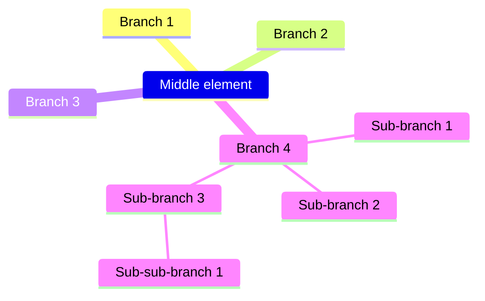

</td><td>

```
mindmap
    Middle element
        Branch 1
        Branch 2
        Branch 3
        Branch 4
            Sub-branch 1
            Sub-branch 2
            Sub-branch 3
                Sub-sub-branch 1
```

<a href="/mindmaps.md">Mindmaps diagram in Mermaid cheatsheet</a></td></tr>

<tr><td>

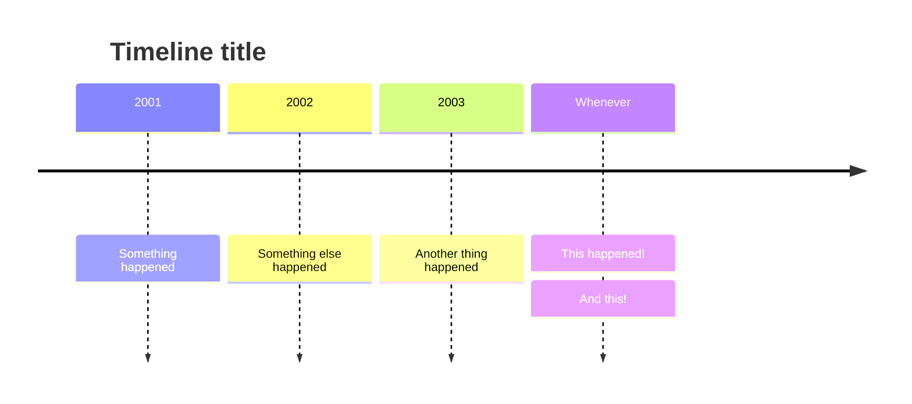

</td><td>

```
timeline
    title Timeline title
    2001: Something happened
    2002: Something else happened
    2003: Another thing happened
    Whenever: This happened!
            : And this!
```

<a href="/timeline.md">Timeline diagram in Mermaid cheatsheet</a></td></tr>

<tr><td>

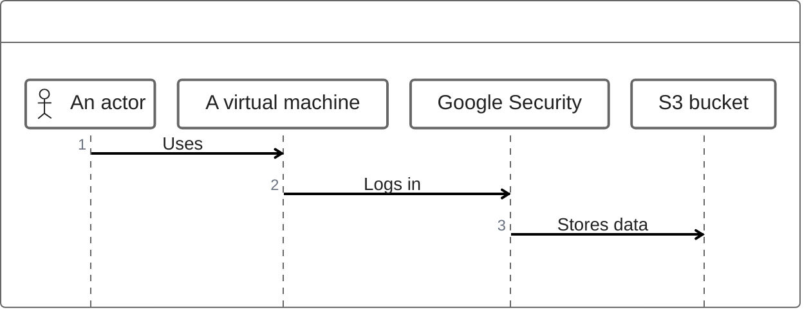

</td><td>

```
zenuml
    @Actor "An actor"
    @VirtualMachine "A virtual machine"
    @GoogleSecurity "Google Security"
    @S3 "S3 bucket"
    "An actor"->"A virtual machine": Uses
    "A virtual machine"->"Google Security": Logs in
    "Google Security"->"S3 bucket": Stores data
```

<a href="/zenuml.md">ZenUML diagram in Mermaid cheatsheet</a></td></tr>

<tr><td>

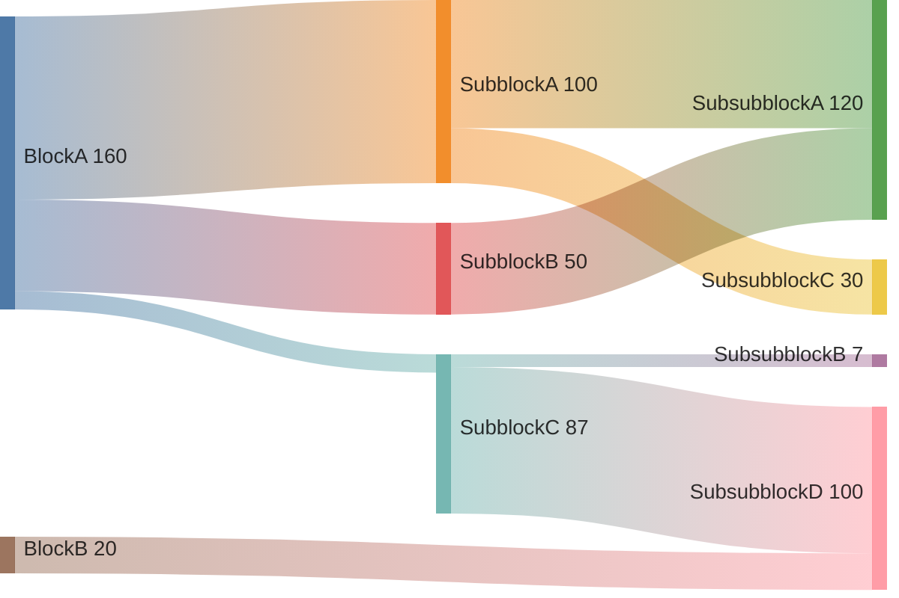

</td><td>

```
sankey-beta
    BlockA,SubblockA,100
    BlockA,SubblockB,50
    BlockA,SubblockC,10
    SubblockA,SubsubblockA,70
    SubblockA,SubsubblockC,30
    SubblockB,SubsubblockA,50
    SubblockC,SubsubblockB,7
    SubblockC,SubsubblockD,80
    BlockB,SubsubblockD,20
```

<a href="/sankey.md">Sankey diagram in Mermaid cheatsheet</a></td></tr>

<tr><td>

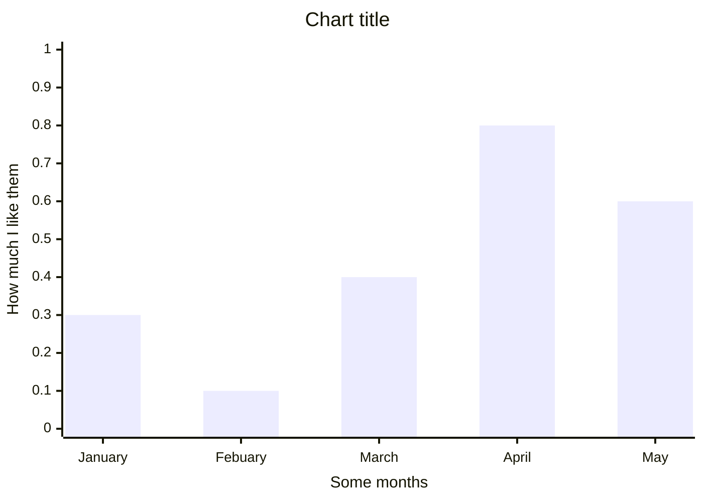

</td><td>

```
xychart-beta
    title "Chart title"
    x-axis "Some months" [January, Febuary, March, April, May]
    y-axis "How much I like them" 0.0 --> 1.0
    bar [0.3, 0.1, 0.4, 0.8, 0.6]
    line [5000, 6000, 7500, 8200, 9500]
```

<a href="/xy.md">XY diagram in Mermaid cheatsheet</a></td></tr>

<tr><td>

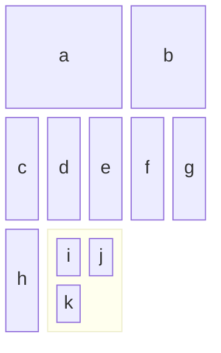

</td><td>

```
block-beta
    columns 5
    a:3 b:2 c d e f g h
    block:myBlock:2
        columns 2
        i j k
    end
```

<a href="/block.md">Block diagram in Mermaid cheatsheet</a></td></tr>

<tr><td>

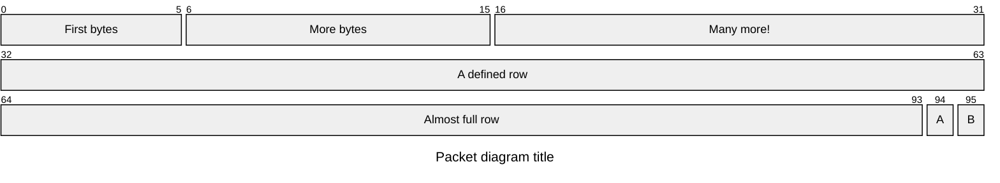

</td><td>

```
packet-beta
    title Packet diagram title
    0-5: "First bytes"
    6-15: "More bytes"
    16-31: "Many more!"
    32-63: "A defined row"
    64-93: "Almost full row"
    94: "A"
    95: "B"
```

<a href="/packet.md">Packet diagram in Mermaid cheatsheet</a></td></tr>

<tr><td>

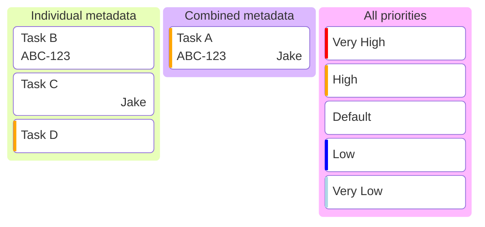

</td><td>

```
kanban
    Individual metadata
        Task B@{ ticket: ABC-123 }
        Task C@{ assigned: 'Jake' }
        Task D@{ priority: 'High' }
    Combined metadata
        Task A@{ ticket: ABC-123, assigned: 'Jake', priority: 'High' }
    All priorities
        Very High@{ priority: 'Very High' }
        High@{ priority: 'High' }
        Default
        Low@{ priority: 'Low' }
        Very Low@{ priority: 'Very Low' }
```

<a href="/kanban.md">Kanban diagram in Mermaid cheatsheet</a></td></tr>

<tr><td>

```mermaid
architecture-beta
    service db(database)[Database]
    service disk1(disk)[Storage]
    service disk2(disk)[Storage]
    service server(server)[Server]

    db:L <-- R:server
    disk1:T -- B:server
    disk2:T <-- B:db
```

</td><td>

```
architecture-beta
    service db(database)[Database]
    service disk1(disk)[Storage]
    service disk2(disk)[Storage]
    service server(server)[Server]

    db:L <-- R:server
    disk1:T -- B:server
    disk2:T <-- B:db
```

<a href="/architecture.md">Architecture diagram in Mermaid cheatsheet</a></td></tr>

<tr><td>

```mermaid
radar-beta
    title Language skills
    axis English, French, German, Spanish, Dutch, Scottish, Welsh
    curve a["User1"]{20, 30, 50, 60, 80, 30, 30}
    curve b["User2"]{80, 30, 40, 50, 90, 10, 20}
    curve c["User3"]{100, 100, 30, 50, 70, 70, 40}
```

</td><td>

```
radar-beta
    title Language skills
    axis English, French, German, Spanish, Dutch, Scottish, Welsh
    curve a["User1"]{20, 30, 50, 60, 80, 30, 30}
    curve b["User2"]{80, 30, 40, 50, 90, 10, 20}
    curve c["User3"]{100, 100, 30, 50, 70, 70, 40}
```

<a href="/radar.md">Radar diagram in Mermaid cheatsheet</a></td></tr>

</table>
