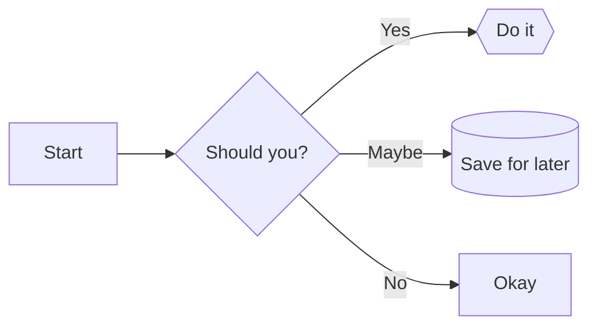
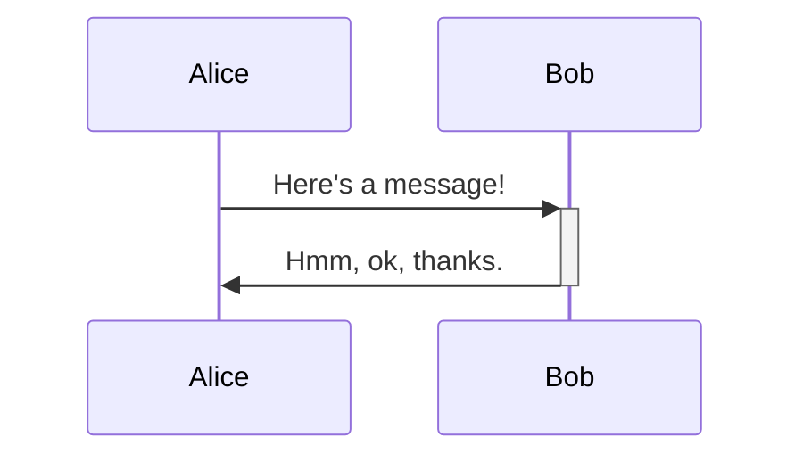
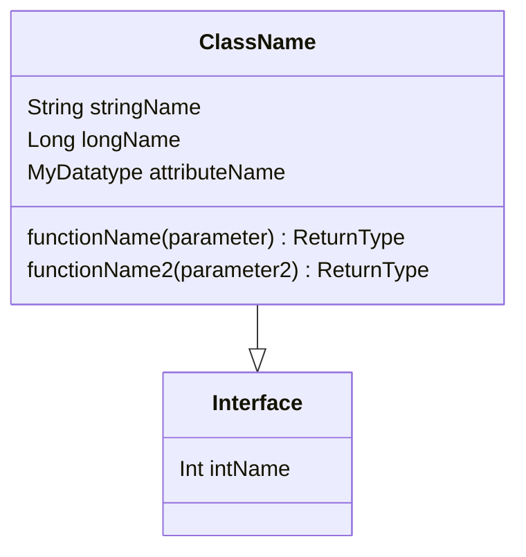
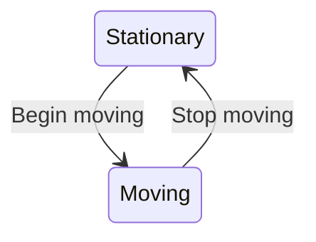
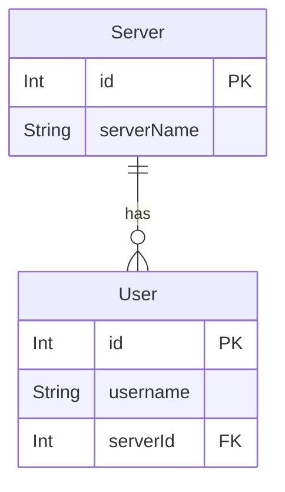
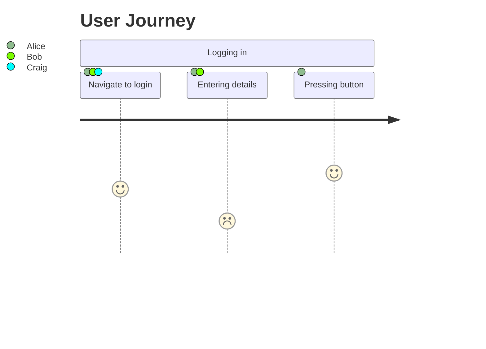

# Mermaid syntax references

A concise rewrite of [the mermaid documentation](https://mermaid-js.github.io/mermaid/) for quick lookups.

Meta:
* Overview (comments, configuring, etc)

<table>
<tr><td>Example</td><td>Code</td></tr>

<tr><td>



</td><td>

```
flowchart LR
    A[Start] --> B{Should you?}
    B -- Yes --> C{{Do it}}
    B -- Maybe --> D[(Save for later)]
    B -- No --> E[Okay]
```

<a href="/1-flowchart.md">1: Flowchart syntax</a>
</td></tr>
<tr><td>



</td><td>

```
sequenceDiagram
    Alice ->>+ Bob: Here's a message!
    Bob ->>- Alice: Hmm, ok, thanks.
```

<a href="/2-sequence.md">2: Sequence diagram syntax</a>
</td></tr>
<tr><td>



</td><td>

```
classDiagram
    class ClassName {
        String stringName
        Long longName
        MyDatatype attributeName

        functionName(parameter) ReturnType
        functionName2(parameter2) ReturnType
    }
    class Interface {
        Int intName
    }
    ClassName --|> Interface
```
<a href="/3-class.md">3: Class diagram syntax</a></td></tr>
<tr><td>



</td><td>

```
stateDiagram-v2
    Stationary --> Moving : Begin moving
    Moving --> Stationary : Stop moving
```

<a href="/4-state.md">4: State</a></td></tr>
<tr><td>



</td><td>

```
erDiagram
    User {
        Int id PK
        String username
        Int serverId FK
    }

    Server {
        Int id PK
        String serverName
    }

    Server ||--o{ User : has
```
<a href="/5-entity-relationship.md">5: Entity Relationship</a></td></tr>
<tr><td>



</td><td>

```
journey
    title User Journey
    section Logging in
        Navigate to login: 4: Alice, Bob, Craig
        Entering details: 2: Alice, Bob
        Pressing button: 5: Alice
```

<a href="/6-user-journey.md">6: User Journey</a></td></tr>
<tr><td>
</td><td>
<a href="/7-gantt.md">7: Gantt</a></td></tr>
<tr><td>
</td><td>
<a href="/8-pie.md">8: Pie</a></td></tr>
<tr><td>
</td><td>
<a href="/9-requirement">9: Requirement</a></td></tr>
<tr><td>
</td><td>
<a href="/10-others.md">10: Others</a></td></tr>

</table>