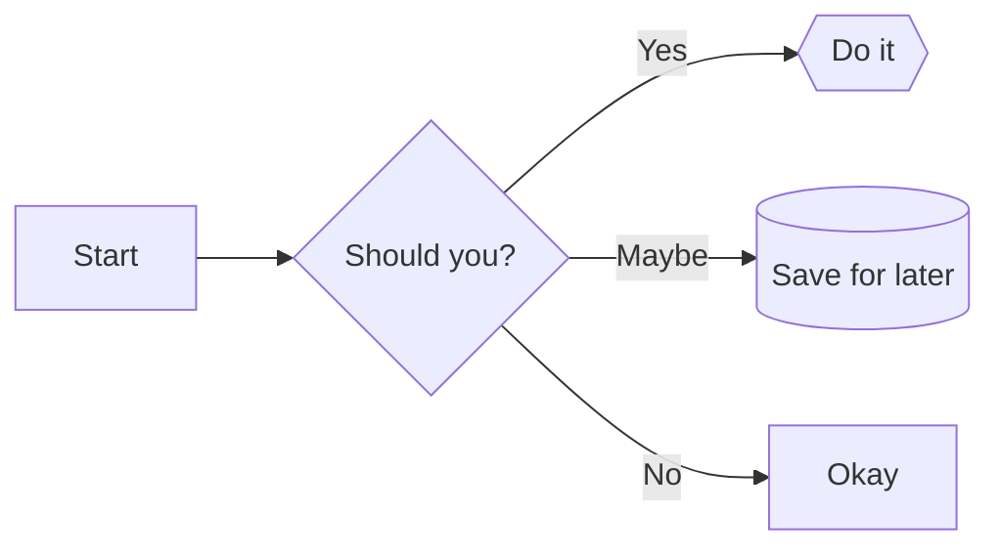
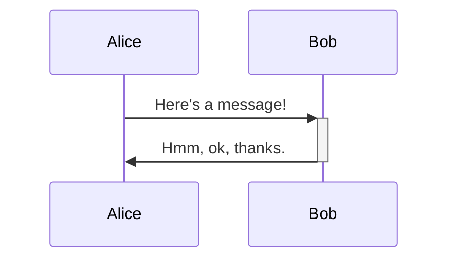
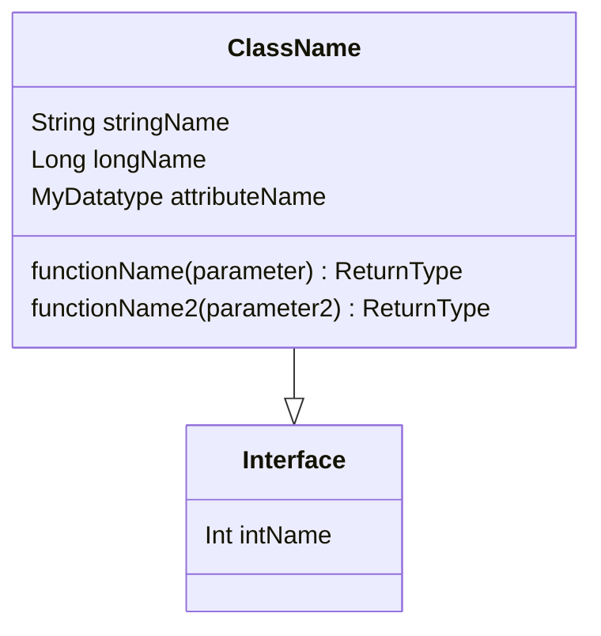
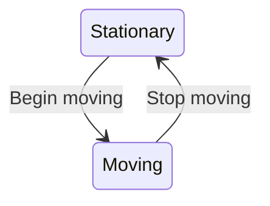
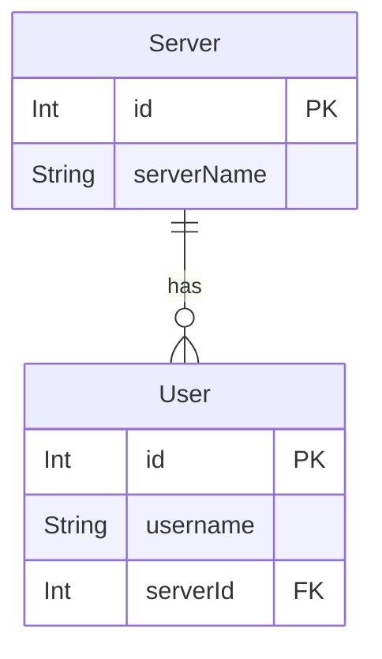
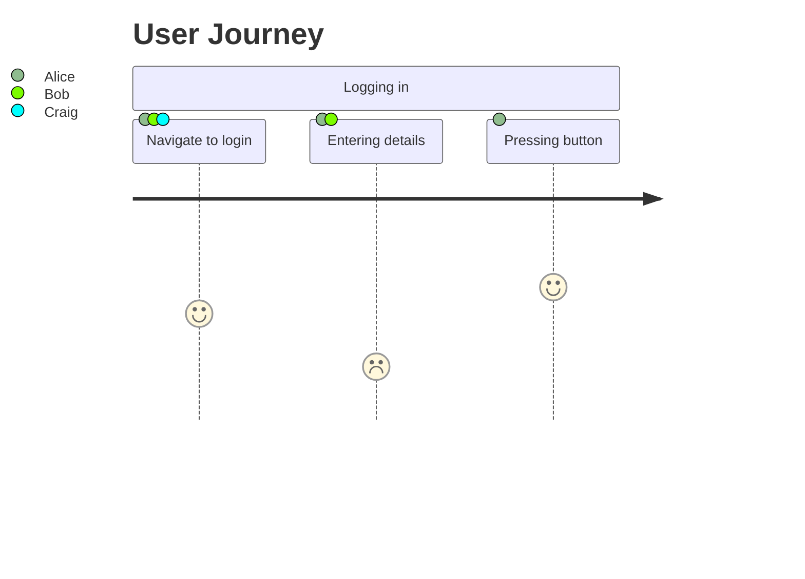
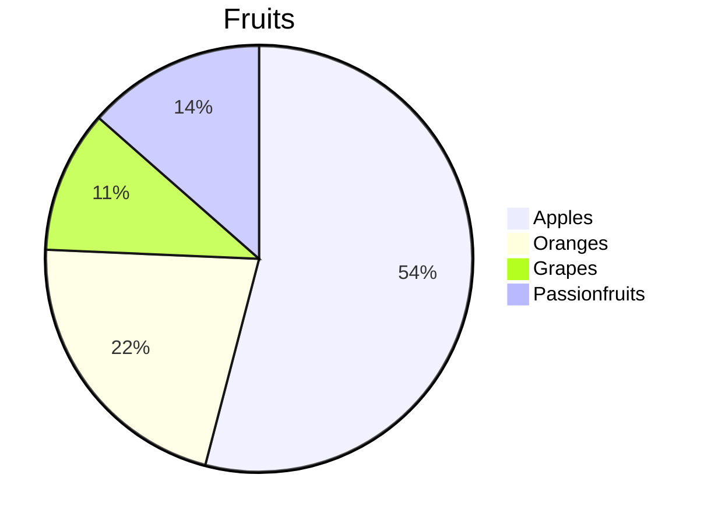
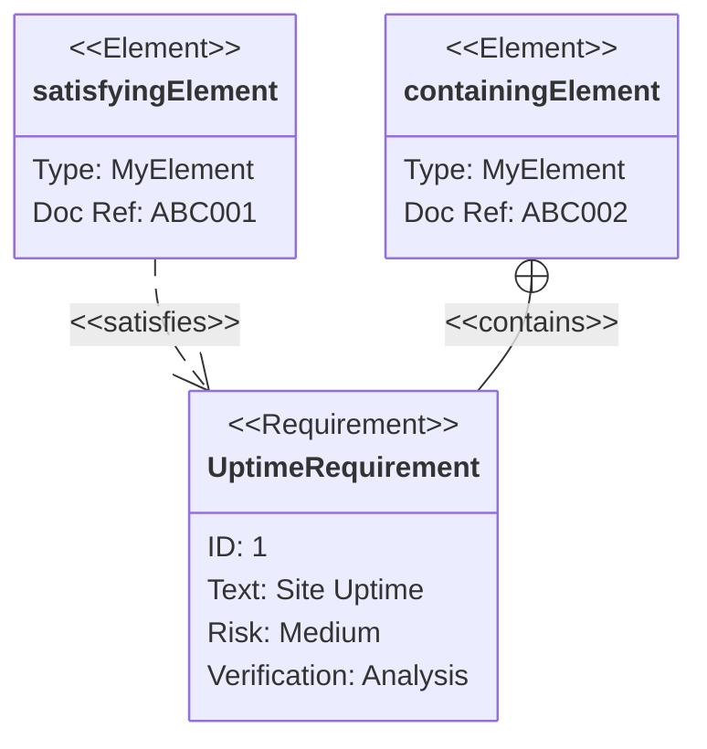

# Mermaid syntax references

A concise rewrite of [the Mermaid documentation](https://mermaid-js.github.io/mermaid/) as a learning aid and cheatsheet.

<table>
<tr><td>Example</td><td>Code</td></tr>

<tr><td>



</td><td>

```
flowchart LR
    A[Start] --> B{Should you?}
    B -- Yes --> C{{Do it}}
    B -- Maybe --> D[(Save for later)]
    B -- No --> E[Okay]
```

<a href="/flowchart.md">Flowchart in Mermaid cheatsheet</a>
</td></tr>
<tr><td>



</td><td>

```
sequenceDiagram
    Alice ->>+ Bob: Here's a message!
    Bob ->>- Alice: Hmm, ok, thanks.
```

<a href="/sequence.md">Sequence diagram in Mermaid cheatsheet</a>
</td></tr>
<tr><td>



</td><td>

```
classDiagram
    class ClassName {
        String stringName
        Long longName
        MyDatatype attributeName

        functionName(parameter) ReturnType
        functionName2(parameter2) ReturnType
    }
    class Interface {
        Int intName
    }
    ClassName --|> Interface
```
<a href="/class.md">Class diagram in Mermaid cheatsheet</a></td></tr>
<tr><td>



</td><td>

```
stateDiagram-v2
    Stationary --> Moving : Begin moving
    Moving --> Stationary : Stop moving
```

<a href="/state.md">State diagram in Mermaid cheatsheet</a></td></tr>
<tr><td>



</td><td>

```
erDiagram
    User {
        Int id PK
        String username
        Int serverId FK
    }

    Server {
        Int id PK
        String serverName
    }

    Server ||--o{ User : has
```
<a href="/entity-relationship.md">Entity relationship diagram in Mermaid cheatsheet</a></td></tr>
<tr><td>



</td><td>

```
journey
    title User Journey
    section Logging in
        Navigate to login: 4: Alice, Bob, Craig
        Entering details: 2: Alice, Bob
        Pressing button: 5: Alice
```

<a href="/user-journey.md">User journey diagram in Mermaid cheatsheet</a></td></tr>
<tr><td>

```mermaid
gantt
    Dated Milestone: milestone, m1, today, 1d
    Relative Milestone: milestone, m2, after m1, 1d
    Task 1: a1, today, 1d
    Task 2: a2, after a1, 1d
    Task 3: a3, today, 36hr
```

</td><td>

```
gantt
    Dated Milestone: milestone, m1, today, 1d
    Relative Milestone: milestone, m2, after m1, 1d
    Task 1: a1, today, 1d
    Task 2: a2, after a1, 1d
    Task 3: a3, today, 36hr
```

<a href="/gantt.md">Gantt chart in Mermaid cheatsheet</a></td></tr>
<tr><td>



</td><td>

```
pie
    title Fruits
    "Apples" : 50
    "Oranges" : 20
    "Grapes" : 9.99
    "Passionfruits" : 12.5
```

<a href="/pie.md">Pie chart in Mermaid cheatsheet</a></td></tr>
<tr><td>



</td><td>

```
    requirementDiagram

    requirement UptimeRequirement {
        id: 1
        text: Site Uptime 
        risk: Medium
        verifymethod: Analysis
    }

    element satisfyingElement {
        type: MyElement
        docref: ABC001
    }

    element containingElement {
        type: MyElement
        docref: ABC002
    }

    satisfyingElement - satisfies -> UptimeRequirement
    containingElement - contains -> UptimeRequirement
```

<a href="/requirement">Requirement diagram in Mermaid cheatsheet</a></td></tr>
<tr><td>

```mermaid
gitGraph BT:
    commit
    branch branch2
    checkout branch2
    commit
    checkout master
    commit
    merge branch2
```

</td><td>

```
gitGraph BT:
    commit
    branch branch2
    checkout branch2
    commit
    checkout master
    commit
    merge branch2
```

<a href="/git">Git graphs in Mermaid cheatsheet</a></td></tr>
</table>