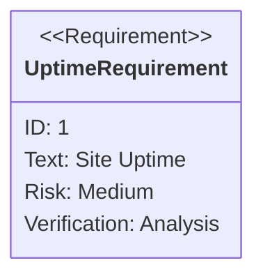
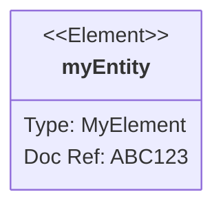
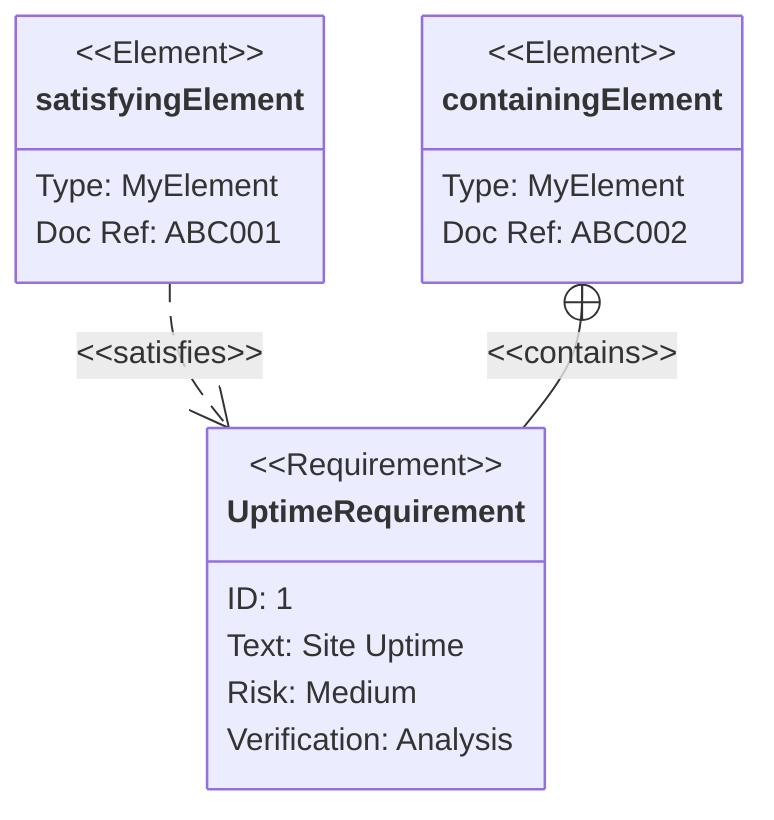

# Requirement diagrams cheatsheet

[Official documentation](https://mermaid-js.github.io/mermaid/#/requirementDiagram).

## Defining requirements

* `requirement` can be replaced by `functionalRequirement`, `interfaceRequirement`, `performanceRequirement`, `physicalRequirement`, or `designConstraint`.
* `risk` can be defined as `Low`, `Medium`, or `High`.
* `verifyMethod` can be defined as `Analysis`, `Inspection`, `Test`, or `Demonstration`.

## Defining elements

## Defining relationships

* `satisfies` can be replaced by `contains`, `copies`, `derives`, `verifies`, `refines`, or `traces`.