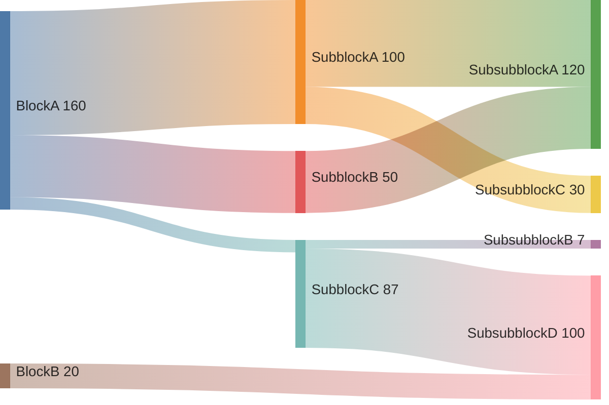

# Sankey charts cheatsheet

[Official documentation](https://mermaid.js.org/syntax/sankey.html).

## Defining

Each row defines a "transaction" between 2 blocks. Note that the values don't necessarily have to make sense (e.g. "SubblockC"), and the totals will be automatically calculated.

Additionally, you can "skip" horizontal layers as needed.



```
sankey-beta
    BlockA,SubblockA,100
    BlockA,SubblockB,50
    BlockA,SubblockC,10
    SubblockA,SubsubblockA,70
    SubblockA,SubsubblockC,30
    SubblockB,SubsubblockA,50
    SubblockC,SubsubblockB,7
    SubblockC,SubsubblockD,80
```

## Styling

Some basic styling is available [within the Mermaid configuration object](https://mermaid.js.org/syntax/sankey.html#configuration).
