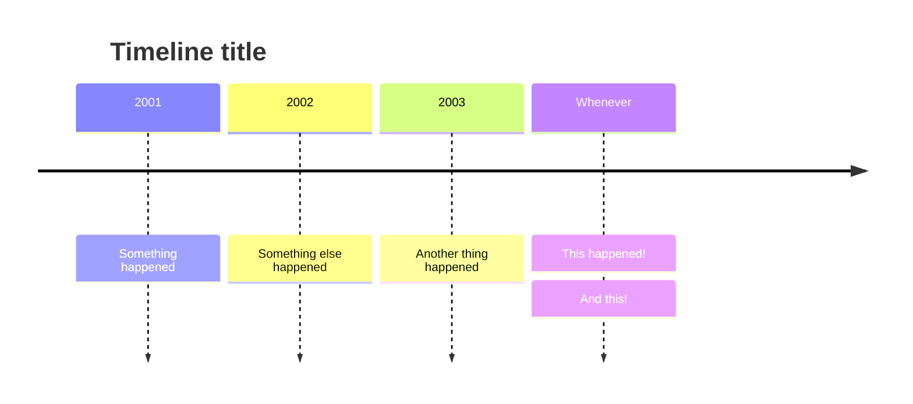
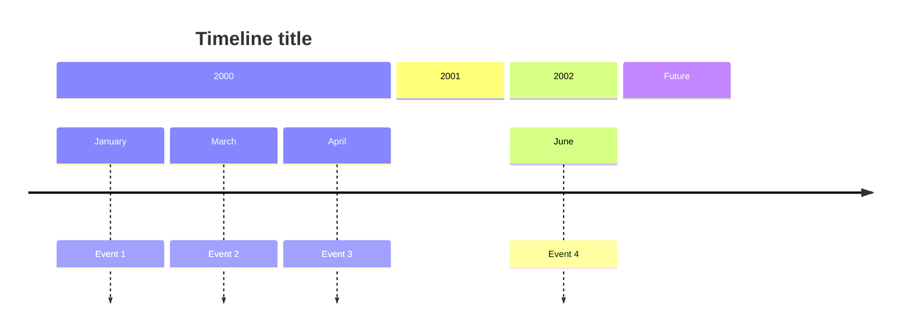

# Timeline charts cheatsheet

[Official documentation](https://mermaid.js.org/syntax/timeline.html).

## Basic syntax



```
timeline
    title Timeline title
    2001: Something happened
    2002: Something else happened
    2003: Another thing happened
    Whenever: This happened!
            : And this!
```

## Grouping



```
timeline
    title Timeline title
    2001: Something happened
    2002: Something else happened
    2003: Another thing happened
    Whenever: This happened!
            : And this!
```

## Styling

The individual elements can be styled, but this must be done [on Mermaid initialization](https://mermaid.js.org/syntax/timeline.html#styling-of-time-periods-and-events), or by [setting a theme](https://mermaid.js.org/syntax/timeline.html#themes).
