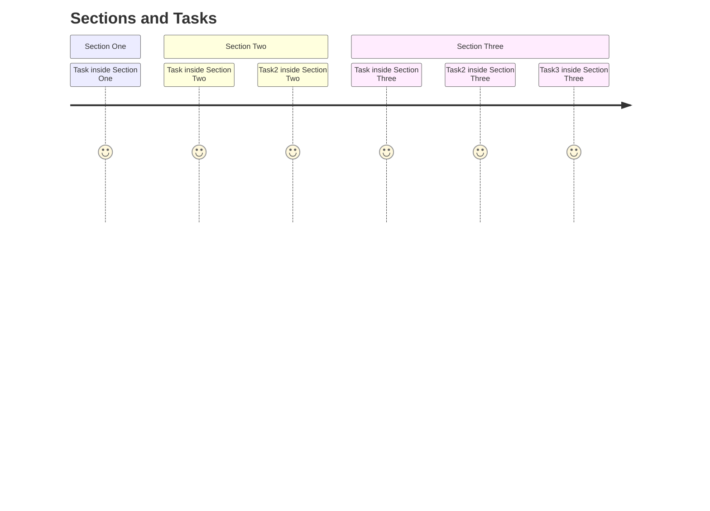
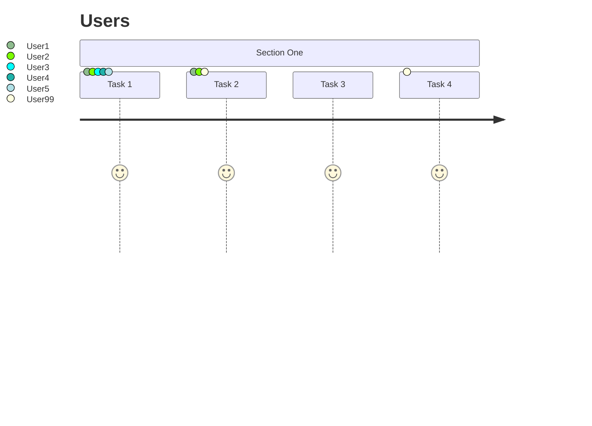
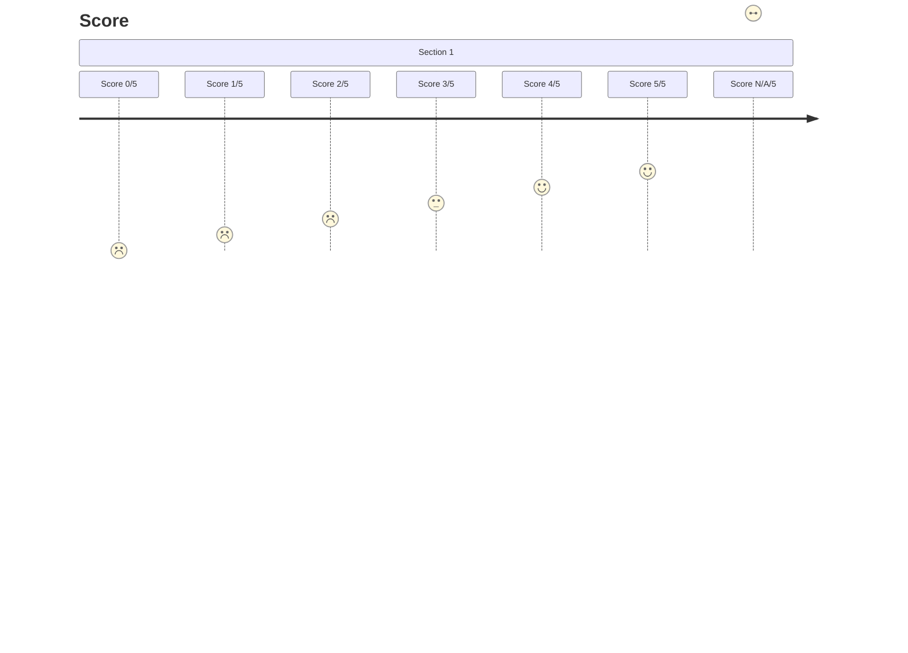

# User journey diagrams cheatsheet

[Official documentation](https://mermaid.js.org/syntax/userJourney.html).

## Defining sections and tasks



```
journey
    title Sections and Tasks
    section Section One
        Task inside Section One: 5
    section Section Two
        Task inside Section Two: 5
        Task2 inside Section Two: 5
    section Section Three
        Task inside Section Three: 5
        Task2 inside Section Three: 5
        Task3 inside Section Three: 5
```

## Defining users



```
journey
    title Users
    section Section One
        Task 1: 5: User1, User2, User3, User4, User5
        Task 2: 5: User1, User2, User99
        Task 3: 5
        Task 4: 5: User99
```

## Defining score



```
journey
    title Score
    section Section 1
        Score 0/5: 0
        Score 1/5: 1
        Score 2/5: 2
        Score 3/5: 3
        Score 4/5: 4
        Score 5/5: 5
        Score N/A/5: X
```
