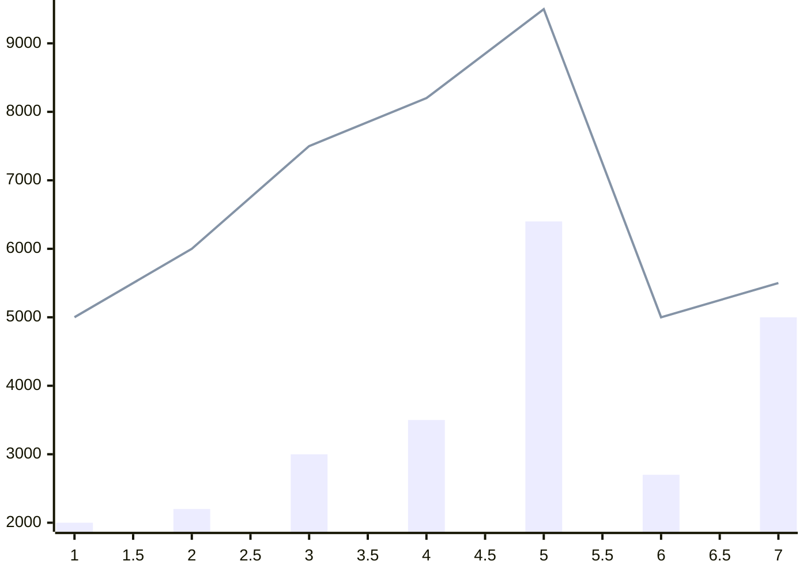
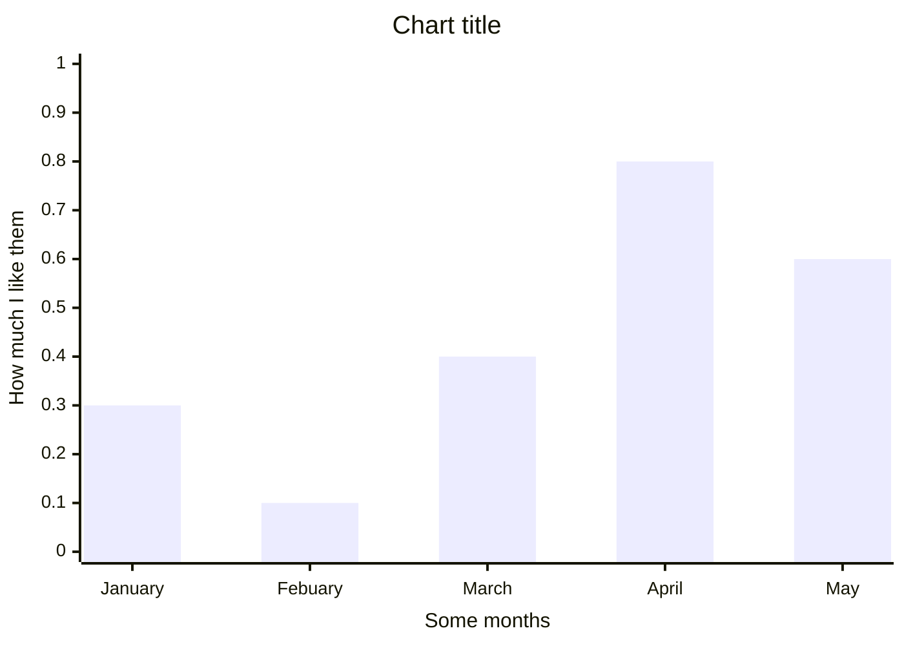
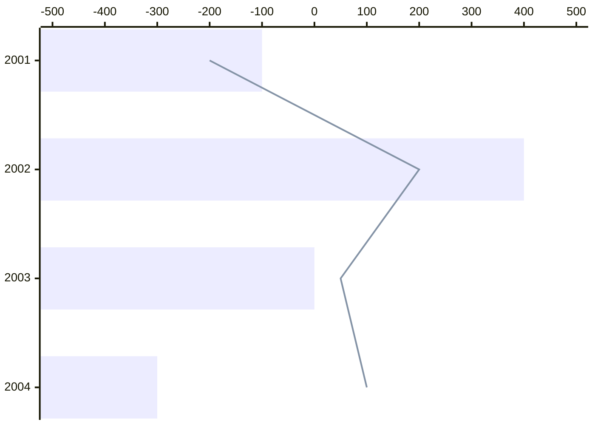

# XY charts cheatsheet

[Official documentation](https://mermaid.js.org/syntax/xyChart.html).

XY charts are, unsurprisingly, meant for charts with an X & Y, e.g. bar or line charts. The mermaid team have stated:

> Therefore, it has the capacity for expansion and the inclusion of additional chart types in the future.

## Automatic values

If you don't explicitly define an axis' title and values, they can be calculated automatically. Both can also define a numerical start and end value.

- The X axis will use the data points index by default. It can also use a numerical start and end value, or arbitrary values.
- The Y axis will be calculated from the data by default. If it is defined it must be numerical (either data points, or a range).



```
xychart-beta
    bar [2000, 2200, 3000, 3500, 6400, 2700, 5000]
    line [5000, 6000, 7500, 8200, 9500, 5000, 5500]
```

## Explicit values



```
xychart-beta
    title "Chart title"
    x-axis "Some months" [January, Febuary, March, April, May]
    y-axis "How much I like them" 0.0 --> 1.0
    bar [0.3, 0.1, 0.4, 0.8, 0.6]
    line [5000, 6000, 7500, 8200, 9500]
```

## Horizontal & negative



```
xychart-beta horizontal
    x-axis [2001, 2002, 2003, 2004]
    y-axis -500 --> 500
    bar [-100, 400, 0, -300]
    line [-200, 200, 50, 100]
```

## Styling

Some basic styling is available [within the Mermaid configuration object](https://mermaid.js.org/syntax/xyChart.html#chart-configurations).
