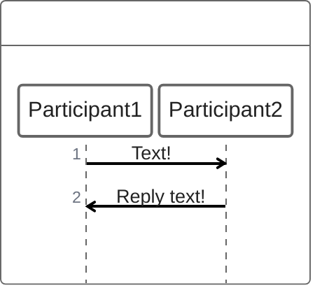
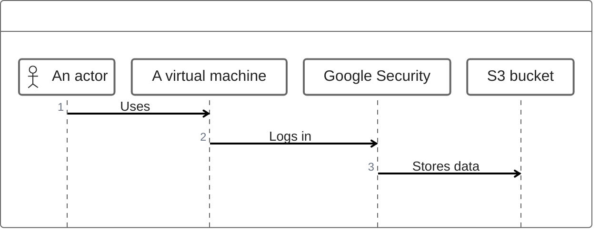
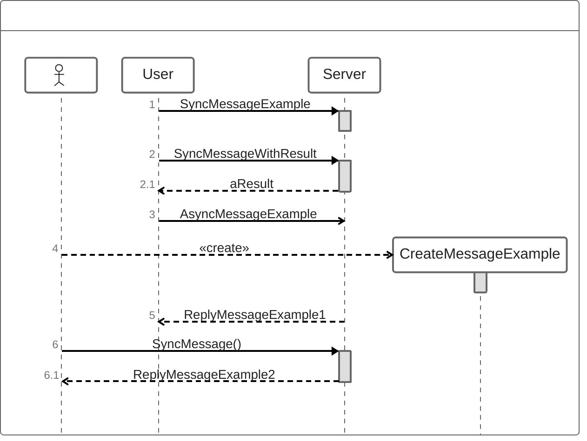
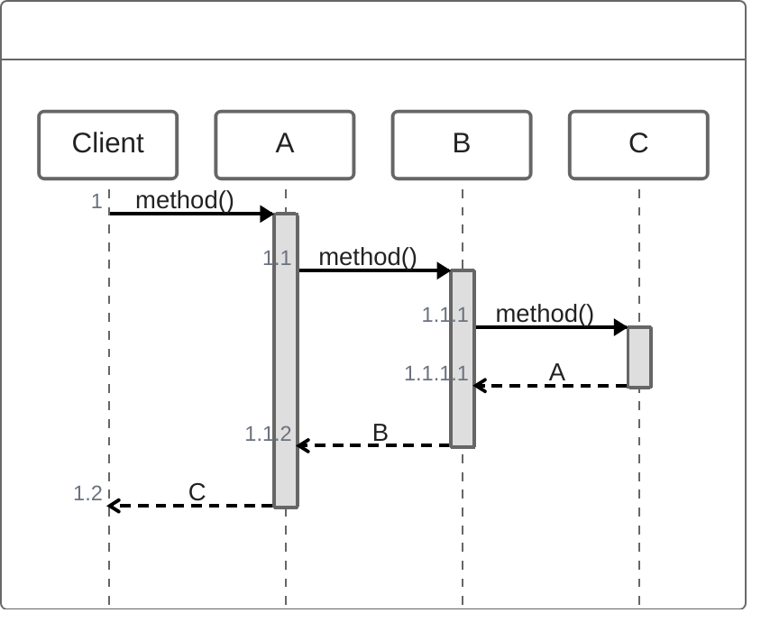
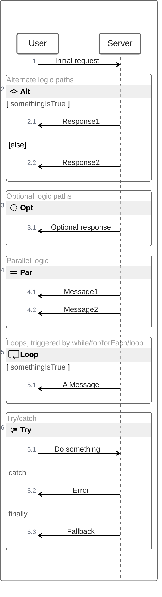

# ZenUML charts cheatsheet

[Official documentation](https://mermaid.js.org/syntax/zenuml.html).

ZenUML is another way of defining [Sequence diagrams](/sequence.md), and seems much more intuitive and straightforward. However, it has slightly different functionality available.

## Participants

### Implicitly defined



```
zenuml
    Participant1->Participant2: Text!
    Participant2->Participant1: Reply text!
```

### Defined with annotators

There are 55 available annotators, with a few default icons available plus some additiona icons available for the primary cloud offerings from Amazon, Azure, and Google. [Here's a full list](https://mermaid.js.org/syntax/zenuml.html#annotators).



```
zenuml
    @Actor "An actor"
    @VirtualMachine "A virtual machine"
    @GoogleSecurity "Google Security"
    @S3 "S3 bucket"
    "An actor"->"A virtual machine": Uses
    "A virtual machine"->"Google Security": Logs in
    "Google Security"->"S3 bucket": Stores data
```

## Message types



```
zenuml
    User -> Server. SyncMessageExample
    User -> Server. SyncMessageWithResult { return aResult }
    User -> Server: AsyncMessageExample
    new CreateMessageExample
    @return Server -> User: ReplyMessageExample1
    ReplyMessageExample2 = Server.SyncMessage()
```

## Nesting



```
zenuml
    Client->A.method() {
      B.method() {
        C.method() {
            return A
        }
        return B
      }
      return C
    }
```

## Groups & Comments



```
zenuml
    User->Server: Initial request
    // Alternate logic paths
    if (somethingIsTrue) {
        Server->User: Response1
    } else {
        Server->User: Response2
    }

    // Optional logic paths
    opt {
        Server->User: Optional response
    }

    // Parallel logic
    par {
        Server->User: Message1
        Server->User: Message2
    }

    // Loops, triggered by while/for/forEach/loop
    while(somethingIsTrue) {
        Server->User: A Message
    }

    // Try/catch
    try {
        User->Server: Do something
    } catch {
        Server->User: Error
    } finally {
        Server->User: Fallback
    }
```
